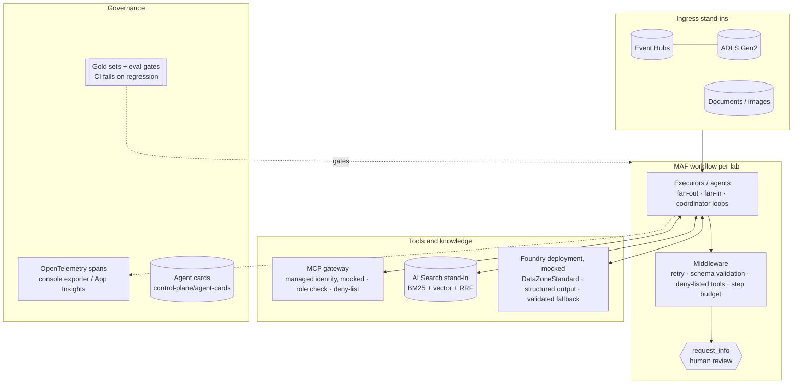

# Jagadish-azure-agent-labs

Five isolated, end-to-end agent labs on **Microsoft Agent Framework (MAF)** and **Azure AI Foundry**, each
wired to Azure AI services: Event Hubs, Data Lake, Functions, AI Search, AI Vision, Document Intelligence,
Maps, Cosmos DB, managed identity and App Insights. Every lab has its own README, code, tests, eval gate,
synthetic data and Bicep.

## At a glance (for recruiters)

- **Five domains, one discipline:** disaster risk from fused sensor signals, retinal-scan research triage, road-network maintenance on a graph, legal and compliance document review, and wind-turbine continual learning.
- **Each lab is a full agent system, not a prompt:** a MAF workflow with parallel branches, a coordinator, bounded loops and human-in-the-loop (HITL) review. It includes structured Pydantic contracts, MCP tools behind a managed-identity gateway, and middleware for retries, schema validation and deny-listed tools.
- **Evaluated, not just demoed:** each lab has a gold set and an eval gate that fails CI on regression. Examples are precision/recall on clause ids, calibration error on the eye scans, historical closure replay for roads, and a lesson-promotion gate for turbines.
- **Safety is designed in:** no automatic public alerts, no EHR write-back, no work orders, no contract signing, and no silent retraining. The rules are enforced in code and checked by evals.
- **Explainable:** per-feature contribution scores (SHAP when installed, otherwise ablation) appear in the eye-scan and turbine reports. The disaster lab reports per-source evidence contributions.
- **Tests and CI:** 161 offline tests, five eval gates, and a Bicep compile check in GitHub Actions.
- **Infrastructure as code, twice:** each lab has Bicep and a Terraform twin ([`infra/terraform`](infra/terraform/README.md)) with offline plan tests, plus a GitHub Actions pipeline with OIDC login and dev -> prod approval gates. The pipeline is switched off until a subscription exists ([docs/deployment.md](docs/deployment.md)).

**Skills demonstrated:** Microsoft Agent Framework, Azure AI Foundry (DataZoneStandard deployments), Azure AI Search (hybrid + vector), Azure AI Vision, Document Intelligence, Azure Maps, Event Hubs, ADLS Gen2, Azure Functions, Cosmos DB, Entra managed identity, MCP, OpenTelemetry / App Insights, Bicep, Terraform, GitHub Actions (OIDC), Python, NetworkX, scikit-learn, Pydantic.

*Honesty note: everything runs offline with deterministic mocks and stand-ins. Nothing has been deployed to Azure (see [Honest note on mocks](#honest-note-on-mocks)).*

**Contents:** [What](#at-a-glance-for-recruiters) · [Why](#why-it-exists) · [Architecture](#architecture-shared-by-every-lab) · [Run](#run-it) · [Test](#test) · [Deploy](#deploy) · [Limits](#honest-note-on-mocks) · [Docs](#documentation)

## Why it exists

Agent patterns are easiest to judge in domains where a wrong answer is costly and a human has to stay in charge: public alerts, medical triage, road budgets, contract review and turbine maintenance. Each lab takes one such problem and shows the full loop on Azure services (ingest, retrieve, reason, explain, evaluate, hand to a person), small enough to read in one sitting and to run offline.

## The labs

| Lab | Problem | Agents / flow | Safety rule | Eval gate highlights |
|---|---|---|---|---|
| [disaster-signal-fusion](labs/disaster-signal-fusion) | seismic + satellite + weather + displacement → flood / quake / tsunami risk | ingest-watch → **parallel** seismic, satellite, weather → historical RAG → Bayesian coordinator → summary → officer HITL | never sends a public alert | signal usage, rain sensitivity, historical replay |
| [medical-eye-scan-multimodal](labs/medical-eye-scan-multimodal) | retinal array + metadata → disease hypotheses (**NOT A MEDICAL DEVICE**) | scans → hybrid RAG → constrained, calibrated reasoning → explainer citing case ids → ophthalmologist HITL | OOD denial, abstain, no EHR write-back | top-1 accuracy, ECE, OOD deny rate, citation validity |
| [road-network-maintenance-graph](labs/road-network-maintenance-graph) | OSM-style city graph → budgeted maintenance plan | coordinator → graph engineering → features → priority → closure impact → narrative → engineer HITL | budget guard, no work orders | route quality, closure replay, priority pairs, usefulness |
| [legal-document-compliance](labs/legal-document-compliance) | contracts / policies → clauses, tables, uncertainty | parse → reliability → **router** → parallel clause / table MCP → classify → **auditor** (redo / escalate) → reviewer HITL | never signs, sends or deletes | clause precision / recall, OCR junk recall, audit, compliance |
| [wind-turbine-continual-learning](labs/wind-turbine-continual-learning) | SCADA telemetry → diagnosis that improves with evaluated experience | static maintenance → episodic memory → context gating → evaluation → technician HITL → learning signals → continual learning | detector and lessons promoted only by eval gates | held-out recall / FPR, lesson gain, gating precision |

## Architecture (shared by every lab)



`shared/labcore` holds the common pieces: config switching (`LAB_MODE=offline|azure`), the Foundry mock and
writer, the MCP gateway, mocked managed identity, middleware, the Event Hubs / ADLS / AI Search stand-ins,
eval helpers, tracing, HITL decisions and agent cards. Labs import `labcore` and never import each other.

## Engineering layers across the labs

Every lab README maps the same 12 layers to code and marks each one honestly. Summary:

| Layer | Disaster | Eye scan | Road | Legal | Turbine |
|---|---|---|---|---|---|
| Business understanding | ✓ | ✓ | ✓ | ✓ | ✓ |
| Data understanding | ✓ | ✓ | ✓ | ✓ | ✓ |
| Knowledge engineering | ✓ | ✓ | ✓ | ✓ | ✓ |
| Model engineering | ✓ | ✓ | ✓ | ✓ | ✓ |
| Context engineering | ✓ | ✓ | ✓ | ✓ | ✓ |
| Semantic engineering | ✓ | ✓ | ✓ | ✓ | ✓ |
| Agent engineering | ✓ | ✓ | ✓ | ✓ | ✓ |
| Loop engineering | – | – | ✓ | ✓ | ✓ |
| Evaluation engineering | ✓ | ✓ | ✓ | ✓ | ✓ |
| Harness engineering | ✓ | ✓ | ✓ | ✓ | ✓ |
| Infrastructure engineering | Bicep + Terraform (validated, not deployed) | Bicep + Terraform (validated, not deployed) | Bicep + Terraform (validated, not deployed) | Bicep + Terraform + reusable MCP servers | Bicep + Terraform (validated, not deployed) |
| Continual learning | – | – | – | – | ✓ |

✓ implemented · – not in scope

## Run it

```bash
git clone https://github.com/jagadishmazure-jpg/Jagadish-azure-agent-labs.git
cd Jagadish-azure-agent-labs
make install          # python -m venv .venv + pip install -e ".[dev]"
make test             # 161 tests, offline
make evals            # all five eval gates, exit 1 on regression
make bicep            # compile every lab's infra/main.bicep (needs the Bicep CLI; never deploys)
# Terraform (offline, mocked provider): cd labs/<lab>/infra/terraform && terraform init -backend=false && terraform test
make lint secrets     # ruff + secrets scan
```

Run a single lab with `pytest -q labs/<lab>` and `python labs/<lab>/evals/run_eval.py`. For explainability
with SHAP instead of ablation, run `pip install shap`.

## Test

```bash
make lint secrets && make test && make evals
python scripts/export_agent_cards.py --check
for d in labs/*/infra/terraform; do terraform -chdir=$d init -backend=false >/dev/null && terraform -chdir=$d test; done
```

CI runs the same checks per lab ([`.github/workflows/ci.yml`](.github/workflows/ci.yml), [`infra.yml`](.github/workflows/infra.yml)).

## Deploy

Not done yet. The GitHub Actions pipeline ([docs/deployment.md](docs/deployment.md)) provisions one lab or all five with Bicep or Terraform, signs in with OIDC and goes dev -> prod with an approval. It stays switched off until the repository variable `DEPLOY_ENABLED` is set. The labs have no long-running service, so only the Azure resources are provisioned.

## Honest note on mocks

* **Nothing is deployed and no cloud resources are created.** `LAB_MODE` defaults to `offline`. Every Azure adapter has an offline stand-in and an Azure stub that raises `AdapterNotConfigured`. The Azure SDKs are not dependencies.
* **The Foundry model is a deterministic mock** (`MockFoundryChatClient`). The labs compute the facts, and the "model" only writes structured text, which is validated with a fallback draft. The metrics therefore measure the harness, retrieval and scoring logic, not an LLM.
* **All data is synthetic** and generated by `labs/*/data/gen_fixtures.py`. Perfect scores on small synthetic gold sets show that the gates work. They do not predict real-world accuracy, and each lab README lists its own limitations.
* **The Bicep templates and Terraform stacks compile and validate but have never been deployed.** Each describes the Azure resources the lab would use, with a user-assigned managed identity and a Foundry DataZoneStandard deployment.
* The medical lab is a research demo and **not a medical device**.
* The deploy pipeline is switched off, and its GitHub Environments and reviewers do not exist yet. No `terraform plan` has run against a subscription.

## Repository layout

```
labs/<lab>/            README · src/ · tests/ · evals/ (run_eval.py + gold/) · data/ (synthetic) · infra/main.bicep · infra/terraform/
shared/labcore/        config · foundry · mcp_gateway · identity · middleware · workflow · evals · search · streams · explain · tracing
control-plane/         agent-cards/*.json (generated; CI checks they are current)
scripts/               run_all_evals · export_agent_cards · secrets_scan · overlap_check
.github/workflows/     ci.yml: lint, shared tests, per-lab tests + eval gate, Bicep build
                       infra.yml: Terraform checks · deploy.yml / teardown.yml: gated OIDC pipeline
infra/terraform/       shared Terraform modules used by every lab stack
docs/                  deployment.md · best-practices.md · adr/ (architecture decisions)
```

## Documentation

| Document | What it covers |
|---|---|
| [`docs/best-practices.md`](docs/best-practices.md) | Enterprise cloud and agentic AI practices, each marked implemented, written-not-deployed or planned, with links to the code |
| [`docs/adr/`](docs/adr/README.md) | Architecture decision records (Bicep + Terraform, offline mocks, OIDC, eval gates, gated deploy, ...) |
| [`docs/implementation-guide.md`](docs/implementation-guide.md) | How a lab is built step by step and how to move it to Azure |
| [`docs/adopt-this.md`](docs/adopt-this.md) | Checklist for reusing the patterns |
| [`docs/components/`](docs/components/README.md) | One page per shared component, 17 sections each |
| [`docs/deployment.md`](docs/deployment.md) | The GitHub Actions pipeline and the one-time Azure setup it needs |
| [`SECURITY.md`](SECURITY.md) · [`CONTRIBUTING.md`](CONTRIBUTING.md) · [`CHANGELOG.md`](CHANGELOG.md) | How to report a vulnerability, how to contribute, what changed |

## License

MIT
