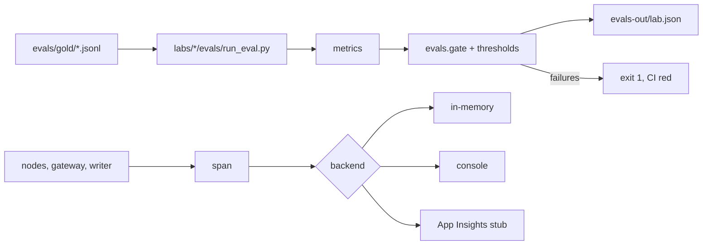

# Eval gate and tracing (`evals.py`, `tracing.py`)

The pass/fail gate each lab runs in CI, and the OpenTelemetry setup that every component writes spans to.

**Sections:** [1. Purpose](#1-purpose) · [2. Architecture](#2-architecture) · [3. How it works](#3-how-it-works) · [4. Key files](#4-key-files) · [5. Code excerpts](#5-code-excerpts) · [6. Configuration](#6-configuration) · [7. Commands](#7-commands) · [8. Real output](#8-real-output) · [9. Tests and eval gates](#9-tests-and-eval-gates) · [10. Guardrails](#10-guardrails) · [11. Security and governance](#11-security-and-governance) · [12. Observability](#12-observability) · [13. Failure modes](#13-failure-modes) · [14. Mapping to Azure services](#14-mapping-to-azure-services) · [15. Limitations](#15-limitations) · [16. Interview talking points](#16-interview-talking-points) · [17. Adopt this](#17-adopt-this)

## 1. Purpose

Each lab declares the metrics that define "working" for its domain (recall on hazard signals, clause coverage, calibration of confidence) and the gate fails CI when any regresses. Tracing makes the same runs inspectable.

## 2. Architecture



## 3. How it works

1. `run_eval.py` loads gold sets with `load_jsonl`, runs the lab and computes metrics such as `precision_recall` and `expected_calibration_error`.
2. `gate` compares each metric with its `Threshold` and lists failures, including missing metrics.
3. `write_report` writes the JSON report CI uploads as an artifact.
4. `configure_tracing` sets up one provider; `span` adds `lab.*` attributes.

## 4. Key files

| File | What it does |
|---|---|
| `shared/labcore/evals.py` | metrics, thresholds, gate, report |
| `shared/labcore/tracing.py` | tracing setup and `span` |
| `labs/*/evals/run_eval.py` | per-lab gate |
| `scripts/run_all_evals.py` | every gate with a summary table |

## 5. Code excerpts

<!-- code: shared/labcore/evals.py::gate -->
```python
def gate(lab: str, metrics: dict[str, float], thresholds: list[Threshold], rows=None) -> GateReport:
    fails = []
    for t in thresholds:
        if t.metric not in metrics:
            fails.append(f"{t.metric}: missing")
        elif not t.ok(metrics[t.metric]):
            fails.append(f"{t.metric}={metrics[t.metric]:.4f} fails {t.op} {t.value}")
    return GateReport(lab, metrics, thresholds, fails, rows or [])
```
<!-- /code -->

<!-- code: shared/labcore/tracing.py::configure_tracing -->
```python
def configure_tracing(service_name: str = "azure-agent-labs", s: LabSettings | None = None) -> str:
    """Idempotent; returns the backend in use."""
    global _backend
    if _backend:
        return _backend
    s = s or settings()
    provider = TracerProvider(resource=Resource.create({"service.name": service_name}))
    provider.add_span_processor(SimpleSpanProcessor(_memory))
    if s.appinsights_connection_string:
        # Real wiring would be azure.monitor.opentelemetry.configure_azure_monitor(); kept out on purpose.
        _backend = "appinsights-stub+memory"
    elif s.trace_console:
        provider.add_span_processor(SimpleSpanProcessor(ConsoleSpanExporter()))
        _backend = "console"
    else:
        _backend = "memory"
    trace.set_tracer_provider(provider)
    return _backend
```
<!-- /code -->

## 6. Configuration

Thresholds live in each lab's `run_eval.py` and are copied into its agent card's `eval_gate`. Tracing: `APPLICATIONINSIGHTS_CONNECTION_STRING`, `LAB_TRACE_CONSOLE=1`.

## 7. Commands

```bash
python scripts/component_demos.py evals workflow
python scripts/run_all_evals.py
```

## 8. Real output

`python scripts/component_demos.py evals workflow`:

<!-- output: python scripts/component_demos.py evals workflow 2>/dev/null -->
```text
precision, recall: (0.<span-id>, 0.<span-id>)
ECE: 0.3
gate: {'lab': 'demo', 'passed': False, 'metrics': {'recall': 0.82, 'ece': 0.04}, 'thresholds': ['recall >= 0.9', 'ece <= 0.1'], 'failures': ['recall=0.8200 fails >= 0.9']}
budget -> redo: step budget 3 exceeded
trail: ['ingest', 'score', 'audit', 'redo']
spans: ['node.ingest', 'node.score', 'node.audit']
```
<!-- /output -->

All five gates (`python scripts/run_all_evals.py`):

<!-- output: python scripts/run_all_evals.py --out /tmp/aal-evals -->
```text
PASS  disaster-signal-fusion: signal_usage_rate=1.0, rain_sensitivity=1.0, replay_hazard_accuracy=1.0, replay_level_within_one=1.0, replay_level_exact=1.0, fallback_flagged=1.0, no_public_alert=1.0
PASS  medical-eye-scan-multimodal: top1_accuracy=0.9688, ece=0.0293, ood_deny_rate=1.0, false_deny_rate=0.0, citation_validity=1.0, ehr_writes=0.0, mean_confidence=0.9698
PASS  road-network-maintenance-graph: detour_within_15pct=1.0, disconnection_accuracy=1.0, hospital_access_accuracy=1.0, stranded_trips_accuracy=1.0, pairwise_order_accuracy=1.0, route_quality=1.0, must_fix_included=1.0, plan_above_median=1.0, budget_respected=1.0, no_work_orders=1.0, plan_segments_at_400k=6.0
PASS  legal-document-compliance: clause_precision=1.0, clause_recall=1.0, label_accuracy=1.0, tables_accounted=1.0, junk_page_recall=1.0, false_page_rejects=0.0, audit_pass_rate=1.0, compliance_checks_passed=1.0, mean_ocr_confidence=0.9655, mean_uncertainty=0.2123, banking_precision=1.0, banking_recall=1.0, healthcare_precision=1.0, healthcare_recall=1.0, insurance_precision=1.0, insurance_recall=1.0
PASS  wind-turbine-continual-learning: heldout_recall=1.0, heldout_fpr=0.0, diagnosis_accuracy=1.0, bad_candidates_rejected=1.0, registry_unchanged_by_agents=1.0, episodes_only_after_review=1.0, lesson_learned_from_feedback=1.0, overbroad_lesson_rejected=1.0, lesson_accuracy_before=0.7, lesson_accuracy_after=0.9, lesson_gain=0.2, gating_precision=1.0, safer_decision_after_learning=1.0, recall_gearbox_bearing=1.0, recall_generator_overheat=1.0, recall_icing=1.0, recall_pitch_fault=1.0
```
<!-- /output -->

## 9. Tests and eval gates

<!-- output: python -m pytest --co -q -p no:cacheprovider shared/tests/test_labcore.py::test_eval_helpers shared/tests/test_labcore.py::test_spans_are_recorded | grep '::' -->
```text
shared/tests/test_labcore.py::test_eval_helpers
shared/tests/test_labcore.py::test_spans_are_recorded
```
<!-- /output -->

## 10. Guardrails

- A metric that is missing fails the gate, so a broken eval cannot pass silently.
- Thresholds are visible in agent cards, which CI checks for drift.

## 11. Security and governance

- Gold sets are synthetic and reviewed with code.
- Eval reports are build artifacts, giving a record per commit.

## 12. Observability

Span names: `node.<name>`, `mcp.call`, `retry`, `tool.denied`, `foundry.write`. In Azure they would land in Application Insights for KQL queries.

## 13. Failure modes

| Failure | Behavior |
|---|---|
| metric below threshold | listed in `failures`, exit 1 |
| metric missing | `<metric>: missing`, exit 1 |
| tracing configured twice | idempotent; first backend wins |

## 14. Mapping to Azure services

| Piece | Azure |
|---|---|
| gate | GitHub Actions job; Azure AI Foundry evaluations could feed the same metrics |
| spans | Application Insights via the Azure Monitor OpenTelemetry distro |

## 15. Limitations

- The App Insights exporter is not a dependency; the backend is a labeled stub.
- Gold sets are small; they catch regressions, not rare failures.

## 16. Interview talking points

- Metrics are chosen per domain, not one generic accuracy number.
- The gate is the same code locally and in CI.

## 17. Adopt this

1. Write a gold set before the agent.
2. Pick two to four metrics and thresholds that a domain expert agrees with.
3. Run the gate in CI and upload the report.
