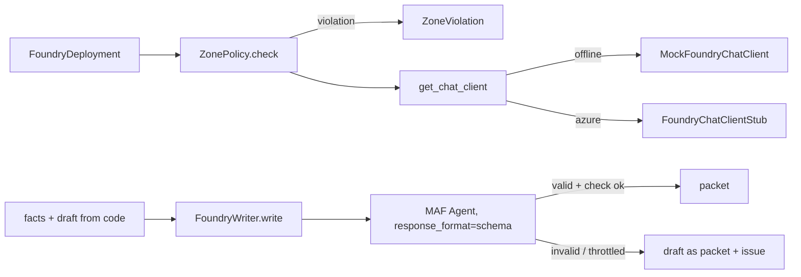

# Foundry access and the writer pattern (`shared/labcore/foundry.py`)

How labs talk to models: a data-zone policy on every deployment, a deterministic mock client, and a writer that lets a model polish but never decide.

**Sections:** [1. Purpose](#1-purpose) · [2. Architecture](#2-architecture) · [3. How it works](#3-how-it-works) · [4. Key files](#4-key-files) · [5. Code excerpts](#5-code-excerpts) · [6. Configuration](#6-configuration) · [7. Commands](#7-commands) · [8. Real output](#8-real-output) · [9. Tests and eval gates](#9-tests-and-eval-gates) · [10. Guardrails](#10-guardrails) · [11. Security and governance](#11-security-and-governance) · [12. Observability](#12-observability) · [13. Failure modes](#13-failure-modes) · [14. Mapping to Azure services](#14-mapping-to-azure-services) · [15. Limitations](#15-limitations) · [16. Interview talking points](#16-interview-talking-points) · [17. Adopt this](#17-adopt-this)

## 1. Purpose

Two concerns drive this module. Data residency: prompts and completions for these domains must stay in one data zone, so Global SKUs and other zones are refused before a client exists. Reliability: model output is the least trustworthy part of a packet, so code computes the facts and the draft, and the model only rewords it under a schema.

## 2. Architecture



## 3. How it works

1. A `FoundryDeployment` names the model, SKU and data zone.
2. `ZonePolicy.check` allows only Data Zone SKUs in the configured zone.
3. `get_chat_client` returns the mock offline and the stub in azure mode.
4. `FoundryWriter.write` sends the facts and draft, asks for the schema as `response_format`, and retries throttling.
5. An optional `check` callback compares the model's packet with the facts; any problem rejects it.
6. On any failure the writer returns the schema-validated draft and an issue string, and counts a degradation.

## 4. Key files

| File | What it does |
|---|---|
| `shared/labcore/foundry.py` | deployment, zone policy, mock client, writer |
| `shared/labcore/config.py` | mode and data zone |
| `labs/*/infra/main.bicep` | the matching Data Zone deployments |

## 5. Code excerpts

<!-- code: shared/labcore/foundry.py::ZonePolicy -->
```python
@dataclass(frozen=True)
class ZonePolicy:
    data_zone: str = "us"
    allowed_skus: frozenset[str] = frozenset({"DataZoneStandard", "DataZoneProvisionedManaged"})

    def check(self, d: FoundryDeployment) -> FoundryDeployment:
        if d.sku not in self.allowed_skus:
            raise ZoneViolation(f"{d.name}: sku {d.sku} may process data outside the {self.data_zone} zone")
        if d.data_zone != self.data_zone:
            raise ZoneViolation(f"{d.name}: deployment zone {d.data_zone} != required {self.data_zone}")
        return d
```
<!-- /code -->

<!-- code: shared/labcore/foundry.py::FoundryWriter.write -->
```python
async def write(
    self,
    *,
    facts: dict[str, Any],
    draft: dict[str, Any],
    check: Callable[[BaseModel], list[str]] | None = None,
) -> tuple[dict[str, Any], list[str]]:
    """Returns (packet, issues). Issues are non-empty only when the draft fallback was used."""
    prompt = (
        f"Use only these facts. Return JSON for {self.schema.__name__}.\n"
        f"```json\n{json.dumps({'facts': facts, 'draft': draft}, default=str)}\n```"
    )
    issues: list[str] = []
    with span("foundry.write", role=self.role, deployment=self.deployment.name):
        try:
            resp = await retry_async(
                lambda: self.agent.run(prompt, options={"response_format": self.schema}),
                attempts=self.attempts,
            )
            value = resp.value
            if value is None:
                value = self.schema.model_validate_json(resp.text)
            problems = check(value) if check else []
            if not problems:
                return value.model_dump(), []
            issues = [f"{self.role}: model output rejected: {p}" for p in problems]
        except (TransientError, ValidationError, ValueError) as exc:
            issues = [f"{self.role}: model unavailable or invalid ({type(exc).__name__})"]
    self.degraded += 1
    return self.schema.model_validate(draft).model_dump(), issues
```
<!-- /code -->

## 6. Configuration

| Setting | Effect |
|---|---|
| `FOUNDRY_DATA_ZONE` | required zone (`us` default) |
| `FoundryDeployment.sku` | must be `DataZoneStandard` or `DataZoneProvisionedManaged` |
| `FoundryWriter.attempts` | retries on throttling |
| `FOUNDRY_PROJECT_ENDPOINT` | endpoint for the azure-mode stub |

## 7. Commands

```bash
python scripts/component_demos.py foundry
pytest -q shared/tests -k "zone or writer"
```

## 8. Real output

<!-- output: python scripts/component_demos.py foundry 2>/dev/null -->
```text
ZonePolicy -> w-global: sku GlobalStandard may process data outside the us zone
ZonePolicy -> w-eu: deployment zone eu != required us
FoundryWriter (2 throttles then success) -> packet == draft: True, issues: []
FoundryWriter (always throttled) -> packet == draft: True, issues: ['dispatch: model unavailable or invalid (TransientError)']
```
<!-- /output -->

## 9. Tests and eval gates

<!-- output: python -m pytest --co -q -p no:cacheprovider shared/tests/test_labcore.py::test_zone_policy_rejects_global_and_other_zone shared/tests/test_labcore.py::test_writer_retries_transient_then_returns_draft shared/tests/test_labcore.py::test_writer_degrades_when_check_fails shared/tests/test_labcore.py::test_writer_degrades_when_model_always_throttled | grep '::' -->
```text
shared/tests/test_labcore.py::test_zone_policy_rejects_global_and_other_zone
shared/tests/test_labcore.py::test_writer_retries_transient_then_returns_draft
shared/tests/test_labcore.py::test_writer_degrades_when_check_fails
shared/tests/test_labcore.py::test_writer_degrades_when_model_always_throttled
```
<!-- /output -->

## 10. Guardrails

- Residency is enforced in code before any client is built, and again in Bicep.
- A model cannot change a computed number: the `check` callback rejects it.
- A model outage yields a degraded packet, never a missing one.

## 11. Security and governance

- Azure clients are meant to use managed identity; Foundry accounts in Bicep set `disableLocalAuth: true`.
- The deployment name and zone appear in each lab's agent card.

## 12. Observability

`foundry.write` span per call with role and deployment; `FoundryWriter.degraded` counts fallbacks and eval gates can assert on it.

## 13. Failure modes

| Failure | Behavior |
|---|---|
| Global SKU or wrong zone | `ZoneViolation` at client creation |
| throttling | retry, then draft fallback |
| invalid JSON / schema | draft fallback with an issue |
| model changed a fact | draft fallback with the rejected reason |

## 14. Mapping to Azure services

| Piece | Azure |
|---|---|
| deployment | Azure AI Foundry model deployment, Data Zone Standard SKU |
| client | Microsoft Agent Framework Foundry chat client with managed identity |
| policy | also expressible as Azure Policy on allowed SKUs |

## 15. Limitations

- The mock returns the draft verbatim, so evals measure the code path, not model quality.
- No content safety call is wired; add Azure AI Content Safety in front of the writer for free text.

## 16. Interview talking points

- Facts from code, words from the model, a schema in between.
- Residency as a unit-tested rule, not a deployment checklist item.

## 17. Adopt this

1. Wrap your model deployments in a `FoundryDeployment` and refuse anything that fails `ZonePolicy`.
2. Move every number and decision into code; give the model a draft to polish.
3. Add a `check` that compares the polished packet with the facts.
4. Track the degradation count in your eval gate.
