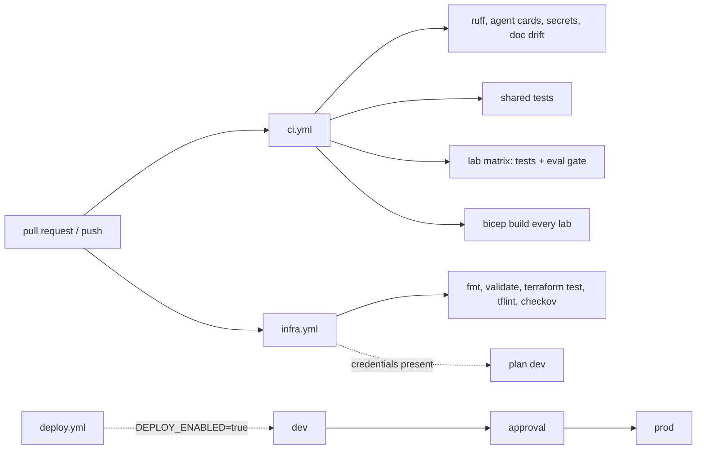

# Infrastructure and CI (`labs/*/infra/`, `.github/workflows/`)

Each lab's Azure footprint written as Bicep and as a Terraform twin, and the pipelines that check it without deploying it.

**Sections:** [1. Purpose](#1-purpose) · [2. Architecture](#2-architecture) · [3. How it works](#3-how-it-works) · [4. Key files](#4-key-files) · [5. Code excerpts](#5-code-excerpts) · [6. Configuration](#6-configuration) · [7. Commands](#7-commands) · [8. Real output](#8-real-output) · [9. Tests and eval gates](#9-tests-and-eval-gates) · [10. Guardrails](#10-guardrails) · [11. Security and governance](#11-security-and-governance) · [12. Observability](#12-observability) · [13. Failure modes](#13-failure-modes) · [14. Mapping to Azure services](#14-mapping-to-azure-services) · [15. Limitations](#15-limitations) · [16. Interview talking points](#16-interview-talking-points) · [17. Adopt this](#17-adopt-this)

## 1. Purpose

The labs run offline, but the infrastructure they would need is written, compiled, validated, linted and plan-tested so that the gap between demo and deployment is visible and reviewed.

## 2. Architecture



## 3. How it works

1. `ci.yml` lints, checks that agent cards match `card.py`, scans for secrets, checks the docs for drift, runs shared tests, and runs each lab's tests and eval gate in a matrix.
2. The bicep job builds every `labs/*/infra/main.bicep`; lab tests also compile their own Bicep when the CLI is present.
3. The two Event Hubs labs (disaster signal fusion, wind turbine) take `privateNetworking` / `private_networking` (default `false`): a VNet with a private-endpoint subnet behind an NSG, a private endpoint on the namespace, the `privatelink.servicebus.windows.net` zone, and Event Hubs public access off. The Terraform side lives in the shared `private-network` module and the `eventhubs` module's `private_endpoint` input.
4. `infra.yml` runs Terraform fmt, validate and `terraform test` with mocked providers, then tflint and checkov.
5. `deploy.yml` and `teardown.yml` only run when the repository variable `DEPLOY_ENABLED` is `true`; it is not set.

## 4. Key files

| File | What it does |
|---|---|
| `.github/workflows/ci.yml` | main CI |
| `.github/workflows/infra.yml` | Terraform checks |
| `.github/workflows/deploy.yml` | gated deploy |
| `.github/workflows/teardown.yml` | gated teardown |
| `labs/*/infra/main.bicep` | per-lab Bicep |
| `labs/*/infra/terraform/` | per-lab Terraform with `tests/plan.tftest.hcl` |
| `infra/terraform/` | shared Terraform modules |
| `shared/labcore/infra_check.py` | Bicep compile helper for tests |

## 5. Code excerpts

<!-- code: shared/labcore/infra_check.py::build -->
```python
def build(main_bicep: Path) -> subprocess.CompletedProcess:
    exe = find_bicep()
    if exe is None:
        raise FileNotFoundError("bicep CLI not found")
    return subprocess.run(
        [exe, "build", str(main_bicep), "--stdout"], capture_output=True, text=True, timeout=180
    )
```
<!-- /code -->

The Foundry account in a lab's Bicep:

<!-- code: labs/disaster-signal-fusion/infra/main.bicep:128-136 -->
```bicep
resource foundry 'Microsoft.CognitiveServices/accounts@2024-10-01' = {
  name: '${prefix}-ai-${suffix}'
  location: location
  tags: tags
  kind: 'AIServices'
  sku: { name: 'S0' }
  identity: { type: 'UserAssigned', userAssignedIdentities: { '${identity.id}': {} } }
  properties: { customSubDomainName: '${prefix}-ai-${suffix}', disableLocalAuth: true, publicNetworkAccess: 'Enabled' }
}
```
<!-- /code -->

## 6. Configuration

Lab Bicep parameters: `prefix`, `location`, data zone. Terraform: `envs/dev.tfvars`, `envs/prod.tfvars` and backend files. Deploy: GitHub Environments `dev` and `prod`, OIDC federated credentials, `DEPLOY_ENABLED`.

## 7. Commands

```bash
for f in labs/*/infra/main.bicep; do bicep build "$f" --stdout > /dev/null; done
terraform -chdir=labs/disaster-signal-fusion/infra/terraform init -backend=false && terraform -chdir=labs/disaster-signal-fusion/infra/terraform test
python scripts/doc_drift.py --check
```

## 8. Real output

Resource types declared across the five labs' Bicep:

<!-- output: grep -h '^resource' labs/*/infra/main.bicep | awk '{print $3}' | tr -d "'" | sort | uniq -c -->
```text
      2 Microsoft.App/managedEnvironments@2024-03-01
      5 Microsoft.CognitiveServices/accounts/deployments@2024-10-01
      6 Microsoft.CognitiveServices/accounts@2024-10-01
      1 Microsoft.DocumentDB/databaseAccounts/sqlDatabases/containers@2024-05-15
      1 Microsoft.DocumentDB/databaseAccounts/sqlDatabases@2024-05-15
      1 Microsoft.DocumentDB/databaseAccounts@2024-05-15
      1 Microsoft.EventHub/namespaces/eventhubs/consumergroups@2024-01-01
      2 Microsoft.EventHub/namespaces/eventhubs@2024-01-01
      2 Microsoft.EventHub/namespaces@2024-01-01
      5 Microsoft.Insights/components@2020-02-02
      5 Microsoft.ManagedIdentity/userAssignedIdentities@2023-01-31
      1 Microsoft.Maps/accounts@2023-06-01
      2 Microsoft.Network/networkSecurityGroups@2024-05-01
      2 Microsoft.Network/privateDnsZones/virtualNetworkLinks@2020-06-01
      2 Microsoft.Network/privateDnsZones@2020-06-01
      2 Microsoft.Network/privateEndpoints/privateDnsZoneGroups@2024-05-01
      2 Microsoft.Network/privateEndpoints@2024-05-01
      2 Microsoft.Network/virtualNetworks@2024-05-01
      5 Microsoft.OperationalInsights/workspaces@2023-09-01
      3 Microsoft.Search/searchServices@2023-11-01
      5 Microsoft.Storage/storageAccounts@2023-05-01
      1 Microsoft.Web/serverfarms@2023-12-01
      1 Microsoft.Web/sites@2023-12-01
```
<!-- /output -->

## 9. Tests and eval gates

Infra tests inside the lab suites:

<!-- output: python -m pytest --co -q -p no:cacheprovider labs | grep -i bicep -->
```text
labs/disaster-signal-fusion/tests/test_dsf_evals_infra.py::test_bicep_compiles
labs/legal-document-compliance/tests/test_legal_workflow.py::test_bicep_compiles
labs/medical-eye-scan-multimodal/tests/test_eye_evals_infra.py::test_bicep_compiles
labs/road-network-maintenance-graph/tests/test_road_workflow.py::test_bicep_compiles
labs/wind-turbine-continual-learning/tests/test_turbine_workflow.py::test_bicep_compiles
```
<!-- /output -->

## 10. Guardrails

- Nothing deploys unless a variable is set and a reviewer approves prod.
- Azure login is OIDC only; no client secret exists.
- checkov runs on every Terraform change.

## 11. Security and governance

- Local (key) auth disabled on Foundry, Search, Event Hubs and Cosmos accounts.
- Event Hubs is no longer hard-coded public: the opt-in private networking option puts it behind a private endpoint with public access off, in Bicep and Terraform, checked by `shared/tests/test_infra_private_networking.py` and the `event_hubs_private` plan tests.
- One user-assigned managed identity per lab.
- Agent cards and docs are drift-checked, so what is reviewed is what runs.

## 12. Observability

Each lab provisions a Log Analytics workspace and an Application Insights component.

## 13. Failure modes

| Failure | Effect |
|---|---|
| Bicep CLI cannot be installed | warning; lab tests skip the compile |
| tflint unavailable | warning; validate still enforced |
| no Azure credentials | plan job skipped with a notice |
| doc output drifted | lint job fails |

## 14. Mapping to Azure services

<!-- output: grep -h '^resource' labs/*/infra/main.bicep | awk '{print $3}' | tr -d "'" | cut -d@ -f1 | sort -u -->
```text
Microsoft.App/managedEnvironments
Microsoft.CognitiveServices/accounts
Microsoft.CognitiveServices/accounts/deployments
Microsoft.DocumentDB/databaseAccounts
Microsoft.DocumentDB/databaseAccounts/sqlDatabases
Microsoft.DocumentDB/databaseAccounts/sqlDatabases/containers
Microsoft.EventHub/namespaces
Microsoft.EventHub/namespaces/eventhubs
Microsoft.EventHub/namespaces/eventhubs/consumergroups
Microsoft.Insights/components
Microsoft.ManagedIdentity/userAssignedIdentities
Microsoft.Maps/accounts
Microsoft.Network/networkSecurityGroups
Microsoft.Network/privateDnsZones
Microsoft.Network/privateDnsZones/virtualNetworkLinks
Microsoft.Network/privateEndpoints
Microsoft.Network/privateEndpoints/privateDnsZoneGroups
Microsoft.Network/virtualNetworks
Microsoft.OperationalInsights/workspaces
Microsoft.Search/searchServices
Microsoft.Storage/storageAccounts
Microsoft.Web/serverfarms
Microsoft.Web/sites
```
<!-- /output -->

## 15. Limitations

- Public network access stays the default to keep the labs cheap. Only Event Hubs has a private networking option so far (written and plan-tested, not deployed); Foundry, Search, Cosmos, Storage and Maps are still public.
- With Event Hubs private, the disaster lab's Consumption-plan Function cannot reach it (Linux Consumption has no VNet integration); producers and consumers must move into, or peer with, the VNet first.
- No deployment has run from this repo.

## 16. Interview talking points

- Two IaC tools on purpose, to show the same footprint both ways.
- Infra is tested offline with mocked providers, so CI needs no subscription.

## 17. Adopt this

1. Pick Bicep or Terraform and delete the other.
2. Turn on `private_networking` for Event Hubs and follow the same pattern for the other data and AI services.
3. Set up OIDC and the two environments, then set `DEPLOY_ENABLED`.
