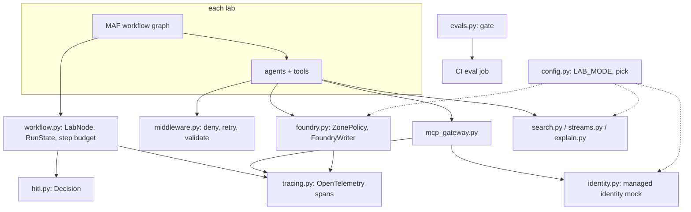

# Shared layer (`shared/labcore/`)

The package every lab imports. It holds everything that is not specific to one domain, so each lab's code is only its graph, its agents and its domain logic.

**Sections:** [1. Purpose](#1-purpose) · [2. Architecture](#2-architecture) · [3. How it works](#3-how-it-works) · [4. Key files](#4-key-files) · [5. Code excerpts](#5-code-excerpts) · [6. Configuration](#6-configuration) · [7. Commands](#7-commands) · [8. Real output](#8-real-output) · [9. Tests and eval gates](#9-tests-and-eval-gates) · [10. Guardrails](#10-guardrails) · [11. Security and governance](#11-security-and-governance) · [12. Observability](#12-observability) · [13. Failure modes](#13-failure-modes) · [14. Mapping to Azure services](#14-mapping-to-azure-services) · [15. Limitations](#15-limitations) · [16. Interview talking points](#16-interview-talking-points) · [17. Adopt this](#17-adopt-this)

## 1. Purpose

Five labs in five domains need the same plumbing: one switch between offline stand-ins and Azure adapters, a governed path to MCP tools, middleware that blocks and validates tool calls, a Foundry access policy, deterministic search and stream stand-ins, tracing, an eval gate and a typed human decision. Writing it once keeps the labs comparable and keeps every guardrail in one reviewed place.

## 2. Architecture



## 3. How it works

1. `config.settings()` reads `LAB_MODE` once; `pick(offline, azure)` chooses the stand-in or the Azure adapter stub.
2. Labs build MAF `Agent`s on the client from `foundry.get_chat_client`, which first runs `ZonePolicy` on the deployment.
3. Tools reach MCP servers only through `McpGateway`, which checks the deny-list, the server allow-list and the token's audience and role.
4. Function middleware from `middleware.py` blocks deny-listed tools and schema-checks tool results before the model sees them.
5. Graph nodes subclass `LabNode`, which counts steps against a budget and opens a span per node.
6. Every graph ends with a request for a `hitl.Decision`; nothing with a side effect runs before a named reviewer answers.
7. Each lab's `evals/run_eval.py` computes metrics and passes them to `evals.gate`, which CI turns into a pass or fail.

## 4. Key files

| File | What it does |
|---|---|
| `shared/labcore/config.py` | `LAB_MODE`, `LabSettings`, `pick`, `AzureStub` |
| `shared/labcore/identity.py` | mocked managed identity tokens with audience and roles |
| `shared/labcore/mcp_gateway.py` | governed MCP tool calls |
| `shared/labcore/middleware.py` | deny, retry and validate middleware; deterministic retry |
| `shared/labcore/foundry.py` | zone policy, mock Foundry chat client, `FoundryWriter` |
| `shared/labcore/search.py` | hybrid search stand-in (BM25 + vector + RRF) |
| `shared/labcore/streams.py` | Event Hubs and Data Lake stand-ins |
| `shared/labcore/explain.py` | per-feature contributions (SHAP or ablation) |
| `shared/labcore/workflow.py` | `LabNode`, `RunState`, run helpers |
| `shared/labcore/hitl.py` | `Decision` with a mandatory reviewer |
| `shared/labcore/evals.py` | metrics and the eval gate |
| `shared/labcore/tracing.py` | OpenTelemetry setup and `span` |
| `shared/labcore/cards.py` | A2A agent card builder |
| `shared/labcore/infra_check.py` | Bicep compile helper used by lab tests |

## 5. Code excerpts

The one switch every adapter goes through:

<!-- code: shared/labcore/config.py::pick -->
```python
def pick(offline: Callable[[], T], azure: Callable[[], T], s: LabSettings | None = None) -> T:
    """Return the offline stand-in or the Azure adapter according to the mode."""
    s = s or settings()
    return azure() if s.azure else offline()
```
<!-- /code -->

<!-- code: shared/labcore/config.py::AzureStub -->
```python
class AzureStub:
    """Base for real-Azure adapter stubs: construction is cheap, any use raises."""

    service = "azure"

    def __init__(self, *args: object, **kwargs: object) -> None:
        self.args = args
        self.kwargs = kwargs

    def _unwired(self, op: str):
        raise AdapterNotConfigured(
            f"{self.service}.{op}: real Azure adapter is a stub in this portfolio (LAB_MODE=azure). "
            "Wire the SDK call here after provisioning; nothing is deployed from this repo."
        )

    def __getattr__(self, op: str):
        if op.startswith("_"):
            raise AttributeError(op)
        return lambda *a, **k: self._unwired(op)
```
<!-- /code -->

## 6. Configuration

| Variable | Default | Effect |
|---|---|---|
| `LAB_MODE` | `offline` | `offline` uses stand-ins; `azure` selects stubs that raise `AdapterNotConfigured` |
| `FOUNDRY_PROJECT_ENDPOINT` | empty | endpoint passed to the Foundry stub |
| `FOUNDRY_DATA_ZONE` | `us` | zone every deployment must be served from |
| `AZURE_CLIENT_ID` | empty | user-assigned managed identity client id |
| `APPLICATIONINSIGHTS_CONNECTION_STRING` | empty | selects the App Insights tracing backend (stubbed) |
| `LAB_TRACE_CONSOLE` | `0` | `1` prints spans to the console |

## 7. Commands

```bash
pip install -e ".[dev]"
pytest -q shared/tests
python scripts/component_demos.py          # every section below
```

## 8. Real output

`python scripts/component_demos.py config`:

<!-- output: python scripts/component_demos.py config 2>/dev/null -->
```text
offline pick -> in-memory stand-in
azure-mode client -> FoundryChatClientStub
first use -> foundry.get_response raises AdapterNotConfigured
LAB_MODE=prod -> LAB_MODE must be offline or azure, got 'prod'
```
<!-- /output -->

## 9. Tests and eval gates

<!-- output: python -m pytest --co -q -p no:cacheprovider shared/tests | grep '::' -->
```text
shared/tests/test_explain.py::test_ablation_attributes_linear_model_exactly
shared/tests/test_labcore.py::test_mode_switch_selects_stub_that_raises
shared/tests/test_labcore.py::test_bad_mode_rejected
shared/tests/test_labcore.py::test_zone_policy_rejects_global_and_other_zone
shared/tests/test_labcore.py::test_writer_retries_transient_then_returns_draft
shared/tests/test_labcore.py::test_writer_degrades_when_check_fails
shared/tests/test_labcore.py::test_writer_degrades_when_model_always_throttled
shared/tests/test_labcore.py::test_deny_listed_tool_never_runs
shared/tests/test_labcore.py::test_tool_result_schema_validation
shared/tests/test_labcore.py::test_retry_async_gives_up
shared/tests/test_labcore.py::test_mcp_gateway_checks_identity_roles_and_deny_list
shared/tests/test_labcore.py::test_hybrid_search_fuses_keyword_and_vector
shared/tests/test_labcore.py::test_event_hub_checkpoint_replay_and_lake
shared/tests/test_labcore.py::test_eval_helpers
shared/tests/test_labcore.py::test_spans_are_recorded
shared/tests/test_repo_docs.py::test_every_component_doc_has_the_17_sections_in_order
shared/tests/test_repo_docs.py::test_every_lab_readme_has_the_17_sections_in_order
shared/tests/test_repo_docs.py::test_component_docs_are_indexed
shared/tests/test_repo_docs.py::test_guides_exist_and_link_components
shared/tests/test_repo_docs.py::test_every_folder_has_a_readme
shared/tests/test_repo_docs.py::test_codeowners
shared/tests/test_repo_docs.py::test_no_placeholders_or_dates_in_docs
shared/tests/test_repo_docs.py::test_readme_test_count_matches_collection
```
<!-- /output -->

The shared tests run as their own CI job; each lab's tests and eval gate run in the lab matrix.

## 10. Guardrails

- No lab reads environment variables directly; one parser rejects unknown modes.
- Azure mode cannot silently fall back to mocks: every stub raises on first use.
- Tool output is untrusted until a schema accepts it.
- Every graph has a step budget and ends at a human decision.

## 11. Security and governance

- No keys, secrets or connection strings exist in code; identity is a managed identity (mocked offline).
- Deny-lists are declared per lab and recorded in the lab's agent card.
- `scripts/secrets_scan.py` runs in CI.

## 12. Observability

`tracing.span` puts a `lab.*` attribute on every span; gateway calls, retries, denials, Foundry writes and graph nodes all emit spans. Tests read them from the in-memory exporter.

## 13. Failure modes

| Failure | Behavior |
|---|---|
| unknown `LAB_MODE` | `ValueError` at startup |
| azure mode without wiring | `AdapterNotConfigured` on first call |
| model throttled | deterministic retry, then the code-computed draft (degraded, still valid) |
| tool returns bad data | result replaced by a `REJECTED` message |
| graph loops | `StepBudgetExceeded` |

## 14. Mapping to Azure services

| Stand-in | Azure service |
|---|---|
| `MockFoundryChatClient` | Azure AI Foundry model deployment (Data Zone SKU) |
| `MockManagedIdentityCredential` | Microsoft Entra managed identity |
| `HybridIndexStandIn` | Azure AI Search |
| `EventHubStandIn`, `DataLakeStandIn` | Azure Event Hubs, ADLS Gen2 |
| in-memory exporter | Application Insights via OpenTelemetry |

## 15. Limitations

- Azure adapters are stubs; nothing is deployed and no SDK call is wired.
- Stand-ins model behavior (ranking, checkpoints, token claims), not service limits or latency.
- Retries have no backoff on purpose, so tests stay fast; a real adapter needs jittered backoff.

## 16. Interview talking points

- One mode switch and loud stubs make the real-Azure seam visible and testable without a subscription.
- Guardrails live in shared middleware, so a new lab inherits them.
- The model only rewords what code computed; a model failure degrades the packet instead of breaking it.

## 17. Adopt this

1. Copy `shared/labcore` into your repo and install it as a package.
2. Replace each `AzureStub` with the SDK call (managed identity, no keys), keeping the class names so tests still select it.
3. Declare your deny-list and MCP role grants per agent.
4. Write an `evals/run_eval.py` that calls `gate` and wire it into CI.
5. See [adopt-this.md](../adopt-this.md) for the full checklist.
