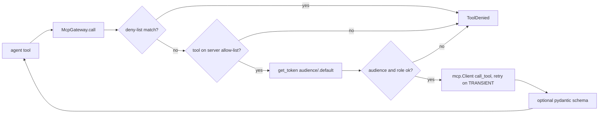

# MCP gateway (`shared/labcore/mcp_gateway.py`)

The only path from a lab's agents to Model Context Protocol tool servers.

**Sections:** [1. Purpose](#1-purpose) · [2. Architecture](#2-architecture) · [3. How it works](#3-how-it-works) · [4. Key files](#4-key-files) · [5. Code excerpts](#5-code-excerpts) · [6. Configuration](#6-configuration) · [7. Commands](#7-commands) · [8. Real output](#8-real-output) · [9. Tests and eval gates](#9-tests-and-eval-gates) · [10. Guardrails](#10-guardrails) · [11. Security and governance](#11-security-and-governance) · [12. Observability](#12-observability) · [13. Failure modes](#13-failure-modes) · [14. Mapping to Azure services](#14-mapping-to-azure-services) · [15. Limitations](#15-limitations) · [16. Interview talking points](#16-interview-talking-points) · [17. Adopt this](#17-adopt-this)

## 1. Purpose

Labs expose domain systems (sensor feeds, contract stores, asset registries) as MCP servers. The gateway makes every call pass the same checks a production deployment behind Entra ID would apply: deny-list, per-server tool allow-list, token audience and app role, retries on transient errors, result schema validation and a span.

## 2. Architecture



## 3. How it works

1. A lab registers each server as an `McpServerRef`: name, server object, audience, and a map of tool to required app role.
2. `_authorize` rejects deny-listed tools first, then tools not on the allow-list.
3. It asks the managed identity for a token scoped to the server's audience and checks the audience and the tool's role.
4. `call` opens an in-process `mcp.Client`, invokes the tool and turns an error containing `TRANSIENT` into a retryable `TransientError`.
5. `retry_async` retries up to three times without sleeping; the payload is unwrapped and, when a schema is given, validated.
6. Each successful call is appended to `calls` and wrapped in an `mcp.call` span.

## 4. Key files

| File | What it does |
|---|---|
| `shared/labcore/mcp_gateway.py` | gateway |
| `shared/labcore/identity.py` | token mock with audience and roles |
| `shared/labcore/middleware.py` | `ToolDenied`, `TransientError`, `retry_async` |
| `labs/*/src/*/` MCP server modules | the per-lab servers registered with the gateway |

## 5. Code excerpts

<!-- code: shared/labcore/mcp_gateway.py::McpGateway._authorize -->
```python
def _authorize(self, ref: McpServerRef, tool: str) -> None:
    if any(fnmatch.fnmatch(tool, p) for p in self.deny):
        raise ToolDenied(f"{ref.name}.{tool} is deny-listed")
    if tool not in ref.tools:
        raise ToolDenied(f"{ref.name}.{tool} is not on the server allow-list")
    tok = self.credential.get_token(f"{ref.audience}/.default")
    if tok.audience != ref.audience:
        raise ToolDenied(f"token audience {tok.audience} != {ref.audience}")
    if ref.tools[tool] not in tok.roles:
        raise ToolDenied(f"identity {tok.client_id} lacks role {ref.tools[tool]} for {ref.name}.{tool}")
```
<!-- /code -->

<!-- code: shared/labcore/identity.py::MockManagedIdentityCredential -->
```python
@dataclass
class MockManagedIdentityCredential:
    client_id: str = "mi-labs-local"
    role_grants: dict[str, set[str]] = field(default_factory=dict)  # audience -> app roles granted
    issued: list[str] = field(default_factory=list)

    def get_token(self, scope: str) -> MockToken:
        audience = scope.removesuffix("/.default")
        digest = hashlib.sha256(f"{self.client_id}|{audience}".encode()).hexdigest()[:16]
        self.issued.append(audience)
        return MockToken(
            token=f"mock-mi.{digest}",
            audience=audience,
            client_id=self.client_id,
            roles=frozenset(self.role_grants.get(audience, set())),
            expires_on=int(time.time()) + 3600,
        )
```
<!-- /code -->

## 6. Configuration

Per lab, in code: the `McpServerRef` tool-to-role map, the role grants on the credential, and the gateway `deny` patterns. `AZURE_CLIENT_ID` names the identity in azure mode.

## 7. Commands

```bash
python scripts/component_demos.py mcp
pytest -q shared/tests -k mcp
```

## 8. Real output

<!-- output: python scripts/component_demos.py mcp 2>/dev/null -->
```text
no role granted: read_asset -> denied: identity mi-labs-local lacks role Assets.Read for assets.read_asset
no role granted: retire_asset -> denied: identity mi-labs-local lacks role Assets.Write for assets.retire_asset
read role granted: read_asset -> {'id': 'A-7', 'status': 'in service'}
read role granted: retire_asset -> denied: assets.retire_asset is deny-listed
```
<!-- /output -->

## 9. Tests and eval gates

<!-- output: python -m pytest --co -q -p no:cacheprovider shared/tests/test_labcore.py::test_mcp_gateway_checks_identity_roles_and_deny_list | grep '::' -->
```text
shared/tests/test_labcore.py::test_mcp_gateway_checks_identity_roles_and_deny_list
```
<!-- /output -->

Every lab's workflow tests also go through its gateway.

## 10. Guardrails

- Deny-list wins over grants: a role cannot unlock a denied tool.
- Unknown tools are refused even when the server offers them.
- Results can be forced through a schema before an agent sees them.

## 11. Security and governance

- Least privilege per tool via app roles, not per server.
- Tokens are requested per audience; `issued` records which audiences an identity asked for, which tests assert on.
- No server credential is ever passed to an agent.

## 12. Observability

One `mcp.call` span per call with `lab.server` and `lab.tool`; retries add `retry` spans with the attempt and error type.

## 13. Failure modes

| Failure | Result |
|---|---|
| deny-listed tool | `ToolDenied` before any token is requested |
| tool not allow-listed | `ToolDenied` |
| missing role | `ToolDenied` naming the identity and role |
| server error with `TRANSIENT` | retried, then raised |
| other server error | `ToolCallError` |
| schema mismatch | pydantic `ValidationError` |

## 14. Mapping to Azure services

| Piece | Azure |
|---|---|
| token check | Entra ID app roles on the MCP server's app registration |
| identity | user-assigned managed identity |
| servers | MCP servers on Azure Container Apps or Functions, optionally behind API Management |

## 15. Limitations

- Servers run in process; there is no network hop, TLS or real token signature.
- No rate limiting or circuit breaker; add them in the gateway when servers are remote.

## 16. Interview talking points

- The gateway simulates the server-side token check, so authorization bugs show up in unit tests.
- Deny-list, allow-list and role are three independent layers.

## 17. Adopt this

1. Give each MCP server its own app registration with one app role per tool class (read, write).
2. Grant roles to the agent's managed identity only for the tools it needs.
3. Swap the in-process client for a streamable HTTP client with a bearer token from `ManagedIdentityCredential`.
4. Keep the deny-list in config and assert on it in tests.
