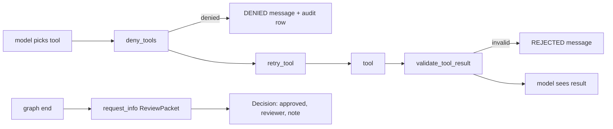

# Tool middleware and human review (`middleware.py`, `hitl.py`)

Function middleware that runs around every tool call a MAF agent makes, plus the typed decision every lab waits for.

**Sections:** [1. Purpose](#1-purpose) · [2. Architecture](#2-architecture) · [3. How it works](#3-how-it-works) · [4. Key files](#4-key-files) · [5. Code excerpts](#5-code-excerpts) · [6. Configuration](#6-configuration) · [7. Commands](#7-commands) · [8. Real output](#8-real-output) · [9. Tests and eval gates](#9-tests-and-eval-gates) · [10. Guardrails](#10-guardrails) · [11. Security and governance](#11-security-and-governance) · [12. Observability](#12-observability) · [13. Failure modes](#13-failure-modes) · [14. Mapping to Azure services](#14-mapping-to-azure-services) · [15. Limitations](#15-limitations) · [16. Interview talking points](#16-interview-talking-points) · [17. Adopt this](#17-adopt-this)

## 1. Purpose

Agents choose tools; middleware decides whether the call runs and whether its result is fit to reach the model. Labs also need one shape for a human answer so that the graph can resume only on an explicit, attributed decision.

## 2. Architecture



## 3. How it works

1. `deny_tools(patterns, audit)` matches the tool name against glob patterns; a match replaces the result with a `DENIED` message, records an audit row and never calls the tool.
2. `retry_tool(attempts)` re-invokes the tool on `TransientError`.
3. `validate_tool_result(schemas)` runs the tool, then validates its result against the schema for that tool name and replaces invalid output with a `REJECTED` message.
4. `retry_async` is the same retry for any awaitable, used by the gateway and the Foundry writer.
5. Graphs end with `ctx.request_info(packet, Decision)`; `Decision` refuses an empty reviewer.

## 4. Key files

| File | What it does |
|---|---|
| `shared/labcore/middleware.py` | deny, retry, validate, `retry_async` |
| `shared/labcore/hitl.py` | `Decision` |
| `labs/*/src/*/workflow.py` | where each lab requests the decision |

## 5. Code excerpts

<!-- code: shared/labcore/middleware.py::deny_tools -->
```python
def deny_tools(patterns: Iterable[str], audit: list[dict[str, Any]] | None = None):
    """Glob patterns, e.g. {"ehr_*", "*_public_alert", "promote_*"}."""
    pats = tuple(patterns)

    @function_middleware
    async def _deny(ctx: FunctionInvocationContext, call_next) -> None:
        name = ctx.function.name
        if any(fnmatch.fnmatch(name, p) for p in pats):
            if audit is not None:
                audit.append({"tool": name, "decision": "denied"})
            with span("tool.denied", tool=name):
                ctx.result = f"DENIED: tool '{name}' is on the deny list for this lab"
            return
        await call_next()

    return _deny
```
<!-- /code -->

<!-- code: shared/labcore/middleware.py::validate_tool_result -->
```python
def validate_tool_result(schemas: dict[str, type[BaseModel]]):
    @function_middleware
    async def _validate(ctx: FunctionInvocationContext, call_next) -> None:
        await call_next()
        schema = schemas.get(ctx.function.name)
        if schema is None:
            return
        try:
            raw = ctx.result
            schema.model_validate_json(raw) if isinstance(raw, str | bytes) else schema.model_validate(raw)
        except ValidationError as exc:
            ctx.result = f"REJECTED: {ctx.function.name} returned data that failed {schema.__name__}: {exc.error_count()} error(s)"

    return _validate
```
<!-- /code -->

<!-- code: shared/labcore/hitl.py::Decision -->
```python
@dataclass
class Decision:
    approved: bool
    reviewer: str
    note: str = ""
    overrides: dict[str, Any] = field(default_factory=dict)

    def __post_init__(self) -> None:
        if not self.reviewer.strip():
            raise ValueError("a decision needs a named reviewer")
```
<!-- /code -->

## 6. Configuration

Per agent in code: the deny patterns (for example `*_public_alert`, `ehr_*`, `promote_*`), the schema map and the retry count.

## 7. Commands

```bash
python scripts/component_demos.py middleware
pytest -q shared/tests -k "deny or validation or retry"
```

## 8. Real output

<!-- output: python scripts/component_demos.py middleware 2>/dev/null -->
```text
deny_tools -> DENIED: tool 'send_public_alert' is on the deny list for this lab | tool ran: False | audit: [{'tool': 'send_public_alert', 'decision': 'denied'}]
validate_tool_result -> REJECTED: lookup returned data that failed Note: 1 error(s)
```
<!-- /output -->

## 9. Tests and eval gates

<!-- output: python -m pytest --co -q -p no:cacheprovider shared/tests/test_labcore.py::test_deny_listed_tool_never_runs shared/tests/test_labcore.py::test_tool_result_schema_validation shared/tests/test_labcore.py::test_retry_async_gives_up | grep '::' -->
```text
shared/tests/test_labcore.py::test_deny_listed_tool_never_runs
shared/tests/test_labcore.py::test_tool_result_schema_validation
shared/tests/test_labcore.py::test_retry_async_gives_up
```
<!-- /output -->

## 10. Guardrails

- Denied tools never execute, even if the model insists.
- Malformed tool output never reaches the model as data.
- A decision without a named reviewer cannot be constructed.

## 11. Security and governance

- Every denial is auditable through the `audit` list and a `tool.denied` span.
- Side-effecting tools in the labs (public alerts, prescriptions, model promotion) are denied to agents and left to humans.

## 12. Observability

`tool.denied` and `retry` spans; the audit list is included in lab review packets.

## 13. Failure modes

| Failure | Behavior |
|---|---|
| denied tool | model gets a `DENIED` string and continues |
| invalid result | model gets a `REJECTED` string |
| transient error past the retry budget | the error propagates to the node |
| empty reviewer | `ValueError` |

## 14. Mapping to Azure services

These run inside the agent process (Microsoft Agent Framework middleware). In Azure the same policy would also be applied at the gateway (API Management or the MCP gateway) so a compromised agent process cannot skip it.

## 15. Limitations

- Middleware is in process, so it protects against model choices, not against a modified agent binary.
- The deny-list is name-based; a renamed tool needs a review.

## 16. Interview talking points

- Fail closed but keep the conversation going: the model is told why, so it can explain to the user.
- Schema validation turns tool output from untrusted text into typed data.

## 17. Adopt this

1. Add `deny_tools` and `validate_tool_result` to every agent by default.
2. Keep side-effecting tools out of agents entirely and behind a human decision.
3. Write a test per denied tool proving it never runs.
