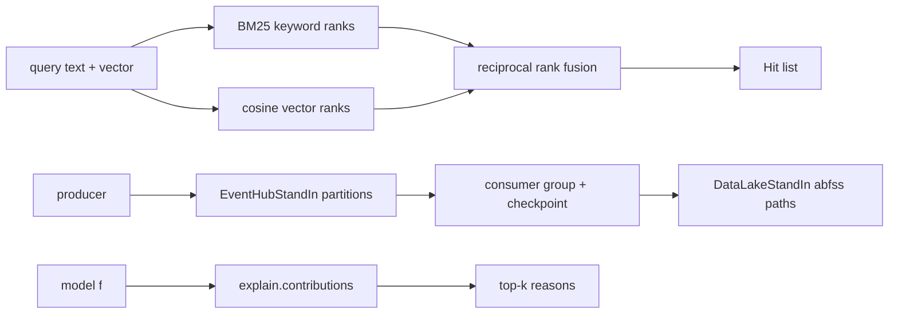

# Search, stream and explanation stand-ins (`search.py`, `streams.py`, `explain.py`)

Deterministic in-memory versions of Azure AI Search, Event Hubs and Data Lake, plus the feature-contribution helper the risk labs use.

**Sections:** [1. Purpose](#1-purpose) · [2. Architecture](#2-architecture) · [3. How it works](#3-how-it-works) · [4. Key files](#4-key-files) · [5. Code excerpts](#5-code-excerpts) · [6. Configuration](#6-configuration) · [7. Commands](#7-commands) · [8. Real output](#8-real-output) · [9. Tests and eval gates](#9-tests-and-eval-gates) · [10. Guardrails](#10-guardrails) · [11. Security and governance](#11-security-and-governance) · [12. Observability](#12-observability) · [13. Failure modes](#13-failure-modes) · [14. Mapping to Azure services](#14-mapping-to-azure-services) · [15. Limitations](#15-limitations) · [16. Interview talking points](#16-interview-talking-points) · [17. Adopt this](#17-adopt-this)

## 1. Purpose

Retrieval, streaming and explanations shape lab behavior, so the stand-ins keep the behavior that matters (hybrid ranking with filters, partitioned replay with checkpoints, abfss paths, per-feature contributions) while staying fast and repeatable for evals.

## 2. Architecture



## 3. How it works

1. `HybridIndexStandIn.upsert` stores documents with text, an optional vector and filterable fields.
2. `search` applies equality filters, ranks by BM25 and by cosine, and fuses the two ranks with RRF (`k=60`).
3. `hash_embed` gives a deterministic vector so tests need no embedding model.
4. `EventHubStandIn.send` assigns a partition by key; `receive` returns events after the consumer group's checkpoint.
5. `DataLakeStandIn.write_json` returns the `abfss://` URI a real lake would have.
6. `explain.contributions` uses SHAP when installed, otherwise ablation against a baseline row.

## 4. Key files

| File | What it does |
|---|---|
| `shared/labcore/search.py` | hybrid index stand-in and stubs |
| `shared/labcore/streams.py` | Event Hubs and Data Lake stand-ins |
| `shared/labcore/explain.py` | feature contributions |

## 5. Code excerpts

<!-- code: shared/labcore/search.py::HybridIndexStandIn.search -->
```python
def search(
    self,
    text: str = "",
    vector: list[float] | None = None,
    *,
    top: int = 5,
    filter: dict[str, Any] | None = None,
    rrf_k: int = 60,
) -> list[Hit]:
    pool = self._filtered(filter)
    kw = self._bm25(text, pool) if text else []
    vec: list[tuple[str, float]] = []
    if vector is not None:
        vec = sorted(
            ((d["id"], cosine(vector, d["vector"])) for d in pool if "vector" in d),
            key=lambda x: (-x[1], x[0]),
        )
    fused: dict[str, float] = {}
    kw_rank = {d: i + 1 for i, (d, _) in enumerate(kw)}
    vec_rank = {d: i + 1 for i, (d, _) in enumerate(vec)}
    sims = dict(vec)
    for ranks in (kw_rank, vec_rank):
        for d, r in ranks.items():
            fused[d] = fused.get(d, 0.0) + 1.0 / (rrf_k + r)
    order = sorted(fused.items(), key=lambda x: (-x[1], x[0]))[:top]
    return [Hit(d, s, self.docs[d], kw_rank.get(d), vec_rank.get(d), sims.get(d, 0.0)) for d, s in order]
```
<!-- /code -->

<!-- code: shared/labcore/streams.py::EventHubStandIn.receive -->
```python
def receive(self, consumer_group: str = "$Default", max_events: int = 10_000) -> list[EventData]:
    """Events after the group's checkpoint, in partition then sequence order."""
    out: list[EventData] = []
    for p in sorted(self._log):
        start = self._checkpoints.get((consumer_group, p), -1) + 1
        out.extend(self._log[p][start:])
    return out[:max_events]
```
<!-- /code -->

## 6. Configuration

Index parameters `k1` and `b` on `HybridIndexStandIn`, `rrf_k` per query, partition count per hub. Real adapters (`AzureSearchStub`, `EventHubProducerStub`, `DataLakeStub`, `CosmosContainerStub`) are selected by `LAB_MODE=azure`.

## 7. Commands

```bash
python scripts/component_demos.py search streams
pytest -q shared/tests -k "search or event or ablation"
```

## 8. Real output

<!-- output: python scripts/component_demos.py search streams 2>/dev/null -->
```text
hybrid
  c1  rrf=0.0328  keyword_rank=1  vector_rank=1
  c3  rrf=0.0323  keyword_rank=2  vector_rank=2
  c2  rrf=0.0159  keyword_rank=None  vector_rank=3
hybrid, filter kind=msa
  c1  rrf=0.0328  keyword_rank=1  vector_rank=1
  c2  rrf=0.0161  keyword_rank=None  vector_rank=2
first read: 6 events
after checkpoint of 4: 2 left for 'scorer', 6 for 'audit'
lake write -> abfss://raw@labsdatalake.dfs.core.windows.net/telemetry/batch-1.json
```
<!-- /output -->

## 9. Tests and eval gates

<!-- output: python -m pytest --co -q -p no:cacheprovider shared/tests/test_labcore.py::test_hybrid_search_fuses_keyword_and_vector shared/tests/test_labcore.py::test_event_hub_checkpoint_replay_and_lake shared/tests/test_explain.py | grep '::' -->
```text
shared/tests/test_labcore.py::test_hybrid_search_fuses_keyword_and_vector
shared/tests/test_labcore.py::test_event_hub_checkpoint_replay_and_lake
shared/tests/test_explain.py::test_ablation_attributes_linear_model_exactly
```
<!-- /output -->

## 10. Guardrails

- Ties are broken by id, so rankings are stable across runs.
- Filters apply before ranking, so a filtered-out document can never be returned.

## 11. Security and governance

- All data is synthetic.
- The real services are configured in Bicep with local auth disabled.

## 12. Observability

Labs record hit ids and ranks in their review packets; stream consumers record checkpoints.

## 13. Failure modes

| Failure | Behavior |
|---|---|
| no keyword match | vector ranks alone decide |
| no vectors | keyword ranks alone decide |
| consumer restarts | resumes after its last checkpoint; other groups unaffected |
| `shap` missing | ablation is used |

## 14. Mapping to Azure services

| Stand-in | Azure |
|---|---|
| `HybridIndexStandIn` | Azure AI Search hybrid query with semantic ranker off |
| `EventHubStandIn` | Azure Event Hubs with consumer groups and checkpoint store |
| `DataLakeStandIn` | ADLS Gen2 |

## 15. Limitations

- `hash_embed` captures token overlap, not meaning.
- No semantic ranker, scoring profiles or vector quantization.
- Event Hubs retention, throughput units and ordering guarantees across partitions are not modeled.

## 16. Interview talking points

- RRF needs no score calibration between keyword and vector, which is why Azure AI Search uses it for hybrid.
- Checkpoints per consumer group let replay and audit read the same stream independently.

## 17. Adopt this

1. Keep the stand-in for tests and evals; add the Azure adapter behind `pick`.
2. Assert on ranks, not scores, in tests.
3. Use a separate consumer group for audit.
