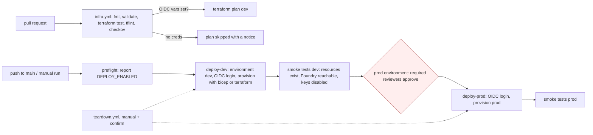

# Deployment: GitHub Actions, OIDC, dev -> prod

This repository deploys with **GitHub Actions** (not Azure DevOps). Infrastructure can be created with **Bicep or Terraform**; the pipeline takes a `deploy_tool` input. Azure login uses **OpenID Connect** (workload identity federation): GitHub issues a short-lived token, Entra ID trusts it through a federated credential, and no client secret exists anywhere.

> **Status: nothing has been deployed.** There is no Azure subscription yet. Every deploy job is gated behind the repository variable `DEPLOY_ENABLED`, which is **not set**, so on each push to `main` the deploy workflow reports the gate and skips its jobs. The pull-request checks (format, validate, offline plan tests, lint, security scan) run for real on every change.

## Workflows

| Workflow | Trigger | What it does |
|---|---|---|
| [`ci.yml`](../.github/workflows/ci.yml) | push to `main`, pull requests | The application checks (lint, tests, eval gates, Bicep build). A `secrets` job runs gitleaks over the full git history. |
| [`codeql.yml`](../.github/workflows/codeql.yml) | push to `main`, pull requests, weekly | CodeQL analysis of the Python code and of the workflow files; findings go to the Security tab. |
| [`infra.yml`](../.github/workflows/infra.yml) | push to `main`, pull requests, manual | `terraform fmt -check`, `init -backend=false`, `validate`, `terraform test` (mocked providers), tflint, checkov. `terraform plan` runs only if the Azure OIDC variables exist; otherwise the job logs a notice and passes, and validation is still enforced. |
| [`deploy.yml`](../.github/workflows/deploy.yml) | push to `main`, manual (`deploy_tool`: `terraform` or `bicep`, `lab`) | Provision each lab in `dev`, smoke test, then after approval the same in `prod`. Gated by `DEPLOY_ENABLED == 'true'`. |
| [`teardown.yml`](../.github/workflows/teardown.yml) | manual only | Destroys one environment for one lab with the tool that created it. Gated by `DEPLOY_ENABLED`, runs in the matching GitHub Environment (so prod teardown also needs approval) and requires typing the environment name again. |

## Pipeline



**Infrastructure.** Each lab is deployed on its own (the `lab` input, or all five as a matrix). `deploy_tool=terraform` applies `labs/<lab>/infra/terraform` with `envs/<env>.tfvars` and remote state (one state key per lab and environment); `deploy_tool=bicep` creates the resource group and runs `az deployment group create` on `labs/<lab>/infra/main.bicep`.

**No images.** The labs have no long-running service to ship: they run as offline Python workflows and tests. The pipeline provisions the Azure resources each lab would call; deploying lab code as Functions or Container Apps jobs is future work.

**Smoke tests.** After provisioning, the smoke step checks that the lab's resources exist, that the Foundry endpoint answers over Entra ID auth, and that local (key) auth is disabled on every AI service.

## One-time setup (when a subscription exists)

Nothing below has been done yet; it is the checklist for the first real deployment.

1. **Identities.** Create one Entra app registration (or user-assigned managed identity) per environment, for example `gh-labs-dev` and `gh-labs-prod`. Give each a service principal.
2. **Federated credentials** (no secrets). On each identity add a GitHub credential with issuer `https://token.actions.githubusercontent.com` and audience `api://AzureADTokenExchange`:
   - dev deploy: subject `repo:jagadishmazure-jpg/Jagadish-azure-agent-labs:environment:dev`
   - prod deploy: subject `repo:jagadishmazure-jpg/Jagadish-azure-agent-labs:environment:prod`
   - PR plans (optional, read-only identity): subject `repo:jagadishmazure-jpg/Jagadish-azure-agent-labs:pull_request`

   ```bash
   az ad app federated-credential create --id <app-object-id> --parameters '{
     "name": "gh-dev", "issuer": "https://token.actions.githubusercontent.com",
     "subject": "repo:jagadishmazure-jpg/Jagadish-azure-agent-labs:environment:dev",
     "audiences": ["api://AzureADTokenExchange"] }'
   ```
3. **RBAC, least privilege.** Scope each identity to its own subscription or resource group: `Contributor` plus `Role Based Access Control Administrator` with a condition that limits it to the data-plane roles the stack assigns, and `Storage Blob Data Contributor` on the Terraform state container. The PR-plan identity gets `Reader` and state read access only.
4. **Terraform state.** Create the state storage account and container once (commands in the Terraform README at [`infra/terraform/README.md`](../infra/terraform/README.md)).
5. **GitHub Environments.** In *Settings -> Environments* create `dev` and `prod`. On `prod` add **required reviewers** (at least one person other than the author where possible), enable *prevent self-review*, and restrict deployment branches to `main`. Optionally add a wait timer.
6. **Variables** (*Settings -> Secrets and variables -> Actions -> Variables*; no secrets needed). Set `AZURE_CLIENT_ID`, `AZURE_TENANT_ID`, `AZURE_SUBSCRIPTION_ID` on each environment (different client ids for dev and prod), and `TFSTATE_RESOURCE_GROUP`, `TFSTATE_STORAGE_ACCOUNT` (optional `TFSTATE_CONTAINER`, `AZURE_LOCATION`, `DEPLOY_TOOL`) at repository level.
7. **Turn it on** by setting the repository variable `DEPLOY_ENABLED` to `true`. Leave it unset until steps 1 to 6 are done and reviewed.

## Rollback and teardown

- **Rollback:** re-run `deploy.yml` from an earlier commit (the image tag is the commit SHA), or `az containerapp revision activate` a previous revision.
- **Teardown:** run `teardown.yml`, pick the environment and tool, and type the environment name to confirm. Dev purges soft-deleted Key Vaults and AI accounts; prod keeps purge protection on.

## What a forward deployed engineer would do at a client

At a client, a forward deployed engineer would start from the client's landing zone rather than this repo's defaults. That means their subscription layout, hub network, private DNS, naming standard, tag policy and whichever IaC tool their platform team already runs. The engineer maps these templates onto that: wires the pipeline to the client's GitHub or Azure DevOps organization with OIDC federated credentials scoped per environment, sets required reviewers that match the client's change-approval process, and turns on private endpoints and the client's policy initiatives before any data flows. After a first dev deployment the engineer runs the smoke tests and eval gates with the client's own data owners, agrees the cost profile and budget alerts, and hands over a runbook (deploy, rollback, teardown, on-call signals) so the client's team can operate it without the engineer. For these labs the early work would be the data: which real signals (sensor feeds, contracts, SCADA history) the client can share, where they may be stored, and which gold cases their domain experts will sign off for the eval gates.
