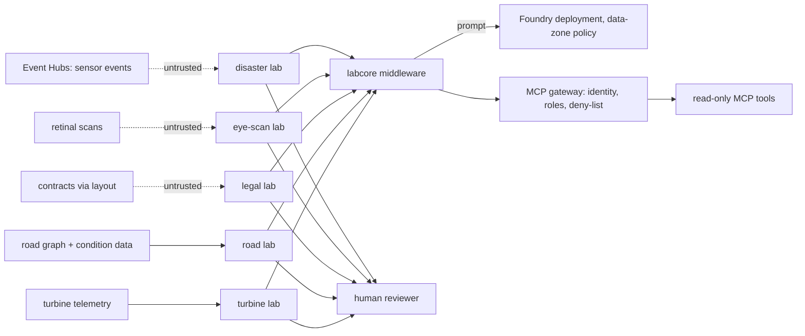

# Threat model

This repository holds five isolated agent labs on Microsoft Agent Framework and Azure AI Foundry:
disaster signal fusion (Event Hubs sensor stream), retinal-scan research triage (vision), road-network
maintenance on a graph, legal and compliance document review (Document Intelligence layout), and
wind-turbine continual learning (model registry). They share `labcore`: Foundry access with a data-zone
policy, an MCP gateway that checks managed identity, roles and a tool deny-list, middleware for retries
and schema validation, hybrid search and Event Hubs checkpointing. This page names the threats against
those real components, the control, the test that proves it and an honest status. **Built** means in
the code and tested offline. **Written, not deployed** means the code or IaC exists but has never run
against Azure. **Planned** means it does not exist yet. Nothing here has been deployed.

Frameworks used: STRIDE for the system, the OWASP Top 10 for LLM Applications 2025 for the model-facing parts, and MITRE ATLAS for
adversary techniques against AI systems.

## System and trust boundaries

Boundaries that matter: sensor events, images and documents from outside (attacker-influenced); a
model's narrative becoming an alert, a report or a plan; any write that would leave the lab (public
alert, EHR, work order, contract signature, model promotion), which the labs do not allow.

## STRIDE

| Threat | Example in this repo | Control | Evidence | Status |
|---|---|---|---|---|
| Spoofing | A caller without the right role reaches a legal MCP tool | MCP gateway checks identity and roles | `test_identity_without_role_is_refused`, `test_mcp_gateway_checks_identity_roles_and_deny_list` | Built (local identities); managed identity written, not deployed |
| Tampering | A replayed Event Hubs batch is fused twice | Checkpointing prevents double ingest; malformed events are dead-lettered | `test_event_hub_checkpoint_prevents_double_ingest`, `test_malformed_events_are_dead_lettered_not_fused` | Built (stand-in) |
| Tampering | Training data changes under a registered model | Registry refuses changed training data | `test_registry_refuses_changed_training_data` | Built |
| Repudiation | "Nobody approved that model" | Promotion needs a named approver and logs rejections; episodes need a named technician | `test_promotion_needs_named_approver`, `test_promotion_rejects_noisy_candidate_and_logs_it`, `test_episode_write_needs_named_technician` | Built |
| Information disclosure | Patient data written back to an EHR | EHR write tool is deny-listed; reader overrides go to a research log | `test_ehr_write_tool_is_deny_listed`, `test_reader_override_goes_to_research_log_not_ehr` | Built |
| Information disclosure | Prompts processed outside the allowed data zone | Zone policy rejects global and other-zone deployments | `test_zone_policy_rejects_global_and_other_zone` | Built (policy in code); Foundry DataZoneStandard written, not deployed |
| Denial of service | A throttled model stalls a lab | Writer retries transient errors, then returns a deterministic draft | `test_writer_retries_transient_then_returns_draft`, `test_writer_degrades_when_model_always_throttled` | Built |
| Denial of service | Unbounded worker calls or spend | Worker call budget; budget guard | `test_worker_call_budget`, `test_budget_guard_raises_on_overspend` | Built |
| Elevation of privilege | An agent calls a deny-listed tool (promote, sign, write-back) | Deny-list enforced in middleware and gateway | `test_deny_listed_tool_never_runs`, `test_promote_tool_is_deny_listed_for_agents`, `test_promotion_is_not_reachable_from_the_workflow` | Built |
| Elevation of privilege | The disaster lab sends a public alert on its own | Approval hands off but never sends; summary claiming an alert is rejected | `test_approval_hands_off_but_never_sends_public_alert`, `test_summary_writer_output_that_claims_an_alert_is_rejected` | Built |

## OWASP Top 10 for LLM Applications 2025

| Risk | How it applies here | Control | Status |
|---|---|---|---|
| LLM01 Prompt injection | Indirect: text inside contracts (legal lab) and sensor payload fields | Closed taxonomy and structured outputs (`test_model_label_outside_taxonomy_is_rejected`); junk pages rejected (`test_junk_page_rejected_clean_page_accepted`); tools are read-only and deny-listed, so injected text has nothing dangerous to call | Partly built. **No prompt-injection text screen in the labs**; adding the Content Safety / Prompt Shields gate is planned |
| LLM02 Sensitive information disclosure | Retinal images and contract text | Fixtures are tiny synthetic arrays and fictional contracts (`test_fixtures_are_tiny_synthetic_arrays`); no EHR write-back | Built (synthetic data only) |
| LLM03 Supply chain | Compromised package or action | Pinned dependencies, SHA-pinned actions, Dependabot, CodeQL, gitleaks, SBOM | Built (no container image in this repo) |
| LLM04 Data and model poisoning | A technician correction or a noisy candidate model degrades the turbine detector | Corrections become signals and candidates, never promotions (`test_correction_becomes_signal_and_candidate_not_promotion`); lesson gate rejects broad lessons; context gating prevents negative transfer | Built |
| LLM05 Improper output handling | A narrative with a wrong total, or an explainer citing an unknown case | Narratives checked against computed facts and replaced (`test_narrative_with_wrong_total_is_replaced_by_draft`, `test_explainer_citing_unknown_case_is_rejected`); tool results schema-validated (`test_tool_result_schema_validation`) | Built |
| LLM06 Excessive agency | Work orders, signatures, alerts or retraining without a person | Labs stop at a human review packet; no work orders (`test_engineer_can_trim_plan_and_no_work_orders_issued`); workflow never retrains (`test_workflow_never_retrains_or_touches_registry`) | Built |
| LLM07 System prompt leakage | Prompts reveal lab logic | Prompts hold no secrets; decisions are code | Built (by design) |
| LLM08 Vector and embedding weaknesses | Retrieval of cases from the wrong region or label | Region-filtered history RAG (`test_history_rag_filters_to_region_and_cites_ids`); summaries cite only retrieved records | Built (in-memory); AI Search written, not deployed |
| LLM09 Misinformation | Overconfident medical triage | Out-of-distribution scans denied before reasoning (`test_every_ood_scan_is_denied_before_reasoning`); calibration; abstain when evidence is split (`test_abstains_when_evidence_is_split`) | Built |
| LLM10 Unbounded consumption | Model and worker spend | Worker call budgets; budget guard; model-selection ceilings (`test_model_selection_respects_ceilings_and_marks_mock_scores`) | Built (counts); Azure budget alerts planned |

## MITRE ATLAS

| Technique | Scenario here | Control |
|---|---|---|
| LLM prompt injection, indirect (AML.T0051.001) | A contract clause tells the model to label everything compliant | Closed taxonomy, auditor redo and escalation (`test_auditor_escalates_when_redo_also_disagrees`), human reviewer |
| Craft adversarial data (AML.T0043) | An image crafted to push the eye-scan model to a confident wrong answer | OOD gate; calibrated probabilities; abstention; research use only |
| Poison training data (AML.T0020) | Corrections that teach the turbine detector to ignore a fault | Named approver, held-out scores, lesson gate |
| Manipulate AI model (AML.T0018) | A swapped champion model in the registry | Registry refuses changed data; promotion unreachable from the workflow |
| AI agent tool invocation (AML.T0053) | Injection tries to call promote or write tools | Deny-list in middleware and gateway |
| Denial of AI service (AML.T0029) | Flood of sensor events | Dead-lettering, stale-reading filter, checkpointing |
| AI supply chain compromise (AML.T0010) | Tampered dependency or action | Pins, SBOM, CodeQL, gitleaks |

## Residual risks

* No text-level injection screen; the labs rely on structured outputs, closed taxonomies, read-only
  tools and human review.
* Event Hubs, Foundry, AI Search and managed identity are stand-ins offline; the IaC is untested
  against Azure.
* The eye-scan lab is research triage on synthetic arrays, not a medical device.
