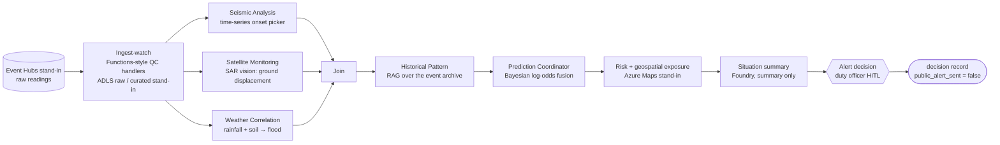

# Disaster signal fusion

Part of [azure-agent-labs](../../README.md). Full 17-section lab doc; output and code blocks are generated by `scripts/doc_drift.py`.

**Sections:** [1. Purpose](#1-purpose) · [2. Architecture](#2-architecture) · [3. How it works](#3-how-it-works) · [4. Key files](#4-key-files) · [5. Code excerpts](#5-code-excerpts) · [6. Configuration](#6-configuration) · [7. Commands](#7-commands) · [8. Real output](#8-real-output) · [9. Tests and eval gates](#9-tests-and-eval-gates) · [10. Guardrails](#10-guardrails) · [11. Security and governance](#11-security-and-governance) · [12. Observability](#12-observability) · [13. Failure modes](#13-failure-modes) · [14. Mapping to Azure services](#14-mapping-to-azure-services) · [15. Limitations](#15-limitations) · [16. Interview talking points](#16-interview-talking-points) · [17. Adopt this](#17-adopt-this)

## 1. Purpose

Seismic waveforms, SAR satellite tiles, weather observations and ground displacement (GNSS uplift, tide gauge)
are fused into a per-region risk score for **flood, quake and tsunami**. Three analysis agents run in parallel,
a historical-pattern agent adds analog events, and a Bayesian coordinator combines everything. Foundry (mocked)
writes the situation summary, and a duty officer decides. **The system never sends a public alert**: there is
no tool for it, the writer's deny-list blocks `*alert*` / `*broadcast*` / `*siren*`, and an eval checks it.
All data is synthetic and all services are offline stand-ins (see the [root README](../../README.md#honest-note-on-mocks)).

## 2. Architecture



### Engineering layers

| Layer | Status | Where |
|---|---|---|
| Business understanding | implemented | decision support for a duty officer; public alerting stays with the authorised person |
| Data understanding | implemented | raw payload QC, stale / neighbour handling, quality weights (`functions.py`, `workflow.IngestWatch`) |
| Knowledge engineering | implemented | historical archive indexed for analog retrieval, facility GeoJSON, hazard playbook |
| Model engineering | implemented | onset picker, SAR displacement, rainfall LLR, Bayesian fusion (`agents.py`) |
| Context engineering | implemented | region context from the Maps stand-in (neighbours, exposure, coastal flag) shapes every agent |
| Semantic engineering | implemented | Pydantic `RawEvent`, `CuratedSignal`, `Finding`, `SituationSummary`, `AlertReview` |
| Agent engineering | implemented | three parallel analysis agents, historical agent, coordinator on MAF fan-out / fan-in |
| Loop engineering | not in scope | one pass per assessment; no re-query loop |
| Evaluation engineering | implemented | signal usage, rain sensitivity, historical replay, fallbacks, no-public-alert |
| Harness engineering | implemented | deny-listed alert tools, schema validation, retries, step budget, summary citation / phrase check |
| Infrastructure engineering | implemented (compile-only) | `infra/main.bicep`: Event Hubs, ADLS Gen2, Function App, Maps, AI Search, Foundry, App Insights; Terraform twin in [`infra/terraform`](infra/terraform/README.md) |
| Continual learning | not in scope | the archive is read-only here; see the wind-turbine lab |

## 3. How it works

### Agents

| Agent | Signals | Method |
|---|---|---|
| Seismic Analysis | seismogram, GNSS / tide displacement | `TinyRecurrentPicker`: a hand-weighted recurrent cell (`h_t = tanh(a·h_{t-1} + b·abs(x_t) + c)`) for onset and coda length. It is a deterministic stand-in, not a trained network |
| Satellite Monitoring | SAR interferogram tiles | Vision stand-in: median phase → ground displacement (mm), coherence as quality. If the tile is missing, it falls back to a neighbouring region |
| Weather Correlation | 24 h rain, rain rate, soil moisture | rainfall → flood likelihood ratio, scaled by a runoff factor for wet ground |
| Historical Pattern | event archive | hybrid retrieval (AI Search stand-in) of analog events in the region → base rates |
| Prediction Coordinator | all findings | posterior log-odds = prior + Σ quality-weight × LLR + small history term. Low-quality or missing sources fall back to the prior and widen the uncertainty |

The three analysis agents are MAF parallel branches (fan-out / fan-in). Ingest-watch drops stale readings and
records why. QC handlers in `functions.py` are shaped like Azure Functions triggers and reject malformed payloads.

### Outputs

* **Risk score:** 0–100 per hazard with a level (low / elevated / high / severe). It is the posterior multiplied by a geospatial exposure factor.
* **Evidence:** per-source contributions, weights, fallbacks and uncertainty for every hazard.
* **Affected facilities** found by point-in-polygon and distance (hospitals, schools, dams, hazmat sites, shelters), plus **decision-support options** for the duty officer.
* **Situation summary** (Foundry, mocked): validated so it only cites sources the fusion used and records that were retrieved, and it contains no forbidden alert phrasing.
* **Alert decision request** (HITL). The officer's decision is recorded. A public alert is never sent automatically.

## 4. Key files

| File | What it does |
|---|---|
| `evals/run_eval.py` | eval gate over the gold sets in `evals/gold/`; exit 1 on regression |
| `data/gen_fixtures.py` | regenerates the synthetic data |
| `infra/main.bicep`, `infra/terraform/` | compile-only infrastructure |
| `tests/` | offline tests for this lab |

## 5. Code excerpts

Bayesian fusion in the coordinator:

<!-- code: labs/disaster-signal-fusion/src/signal_fusion/agents.py::PredictionCoordinator -->
```python
@dataclass
class PredictionCoordinator:
    """Posterior log-odds = prior log-odds + sum over sources of weight * LLR (+ a small history term).
    A source that is missing or below MIN_QUALITY contributes nothing (the posterior falls back to the
    prior for that part of the evidence) and widens the hazard's uncertainty by its importance."""

    name: str = "prediction-coordinator-agent"

    def fuse(
        self, priors: dict[str, float], findings: list[Finding], base_rates: dict[str, float], coastal: bool
    ) -> dict:
        weights: dict[str, float] = {}
        evidence: dict[str, dict[str, float]] = {h: {} for h in HAZARDS}
        fallbacks: dict[str, str] = {}
        for f in findings:
            fallbacks.update(f.fallbacks)
            for s, w in f.weights.items():
                if w < MIN_QUALITY:
                    fallbacks[s] = "prior (low quality)"
                    continue
                weights[s] = w
            for h, per in f.evidence.items():
                for s, llr in per.items():
                    if s in weights:
                        evidence[h][s] = llr
        out: dict = {
            "posterior": {},
            "contributions": {},
            "uncertainty": {},
            "fallbacks": fallbacks,
            "weights": weights,
        }
        for h in HAZARDS:
            prior = priors[h]
            contrib = {s: round(weights[s] * llr, 4) for s, llr in evidence[h].items()}
            hist = HISTORY_WEIGHT * clamp(logit(base_rates[h]) - logit(max(prior, 1e-3)), -1, 1)
            if h == "tsunami" and not coastal:
                contrib, hist = {}, 0.0
            z = logit(prior) + sum(contrib.values()) + hist
            missing = sum(
                IMPORTANCE[h][s] * (0.5 if fallbacks.get(s, "").startswith("neighbour") else 1.0)
                for s in IMPORTANCE[h]
                if s not in weights or fallbacks.get(s, "").startswith("neighbour")
            )
            out["posterior"][h] = round(sigmoid(z), 4)
            out["contributions"][h] = {**contrib, "history": round(hist, 4)}
            out["uncertainty"][h] = round(min(1.0, 0.05 + missing), 3)
        return out
```
<!-- /code -->

The summary check that blocks alert phrasing and uncited sources:

<!-- code: labs/disaster-signal-fusion/src/signal_fusion/summary.py::check_factory -->
```python
def check_factory(state):
    used = set(state.fusion["weights"])
    analog_ids = {a["record_id"] for a in state.analogs}

    def check(s: SituationSummary) -> list[str]:
        problems = []
        if not set(s.cited_sources) <= used:
            problems.append(f"cites sources not used: {sorted(set(s.cited_sources) - used)}")
        if not set(s.cited_records) <= analog_ids:
            problems.append("cites records that were not retrieved")
        text = f"{s.headline} {s.body}".lower()
        problems += [f"forbidden phrase: {p}" for p in FORBIDDEN_PHRASES if p in text]
        return problems

    return check
```
<!-- /code -->

The workflow graph:

<!-- code: labs/disaster-signal-fusion/src/signal_fusion/workflow.py::build_workflow -->
```python
def build_workflow(**deps) -> Workflow:
    ingest = IngestWatch(**deps)
    lanes = [SeismicAnalysis(**deps), SatelliteMonitoring(**deps), WeatherCorrelation(**deps)]
    join, hist, coord = Join(**deps), HistoricalPattern(**deps), Coordinator(**deps)
    summ, decide = SituationSummary(**deps), AlertDecision(**deps)
    return (
        WorkflowBuilder(
            start_executor=ingest,
            name="disaster-signal-fusion",
            max_iterations=30,
            description="Multi-signal hazard fusion with a human alert decision",
        )
        .add_fan_out_edges(ingest, lanes)
        .add_fan_in_edges(lanes, join)
        .add_edge(join, hist)
        .add_edge(hist, coord)
        .add_edge(coord, summ)
        .add_edge(summ, decide)
        .build()
    )
```
<!-- /code -->

## 6. Configuration

| Setting | Effect |
|---|---|
| `LAB_MODE` | `offline` (default: mocks and stand-ins) or `azure` (stub adapters that raise `AdapterNotConfigured`; nothing is deployed) |
| `FOUNDRY_PROJECT_ENDPOINT`, `FOUNDRY_DATA_ZONE` | Foundry project and DataZoneStandard zone (default `us`), checked by `ZonePolicy` |
| `AZURE_CLIENT_ID` | user-assigned managed identity for the MCP gateway |
| `APPLICATIONINSIGHTS_CONNECTION_STRING`, `LAB_TRACE_CONSOLE` | trace export |
| `data/scenarios.json`, `history_archive.jsonl`, `places.geojson` | synthetic readings, analog archive and facilities |
| risk level bands in `risk.py` | low / elevated / high / severe |

## 7. Commands

```bash
pytest -q labs/disaster-signal-fusion
python labs/disaster-signal-fusion/evals/run_eval.py --out evals-out
```

## 8. Real output

`evals/run_eval.py` on the gold sets (offline, deterministic):

<!-- output: python labs/disaster-signal-fusion/evals/run_eval.py --out evals-out -->
```text
{
  "lab": "disaster-signal-fusion",
  "passed": true,
  "metrics": {
    "signal_usage_rate": 1.0,
    "rain_sensitivity": 1.0,
    "replay_hazard_accuracy": 1.0,
    "replay_level_within_one": 1.0,
    "replay_level_exact": 1.0,
    "fallback_flagged": 1.0,
    "no_public_alert": 1.0
  },
  "thresholds": [
    "signal_usage_rate >= 1.0",
    "rain_sensitivity >= 1.0",
    "replay_hazard_accuracy >= 0.85",
    "replay_level_within_one >= 1.0",
    "fallback_flagged >= 1.0",
    "no_public_alert >= 1.0"
  ],
  "failures": []
}
{'kind': 'replay', 'event': 'replay-2019-monsoon', 'predicted': ['flood', 'severe'], 'observed': ['flood', 'severe'], 'scores': {'flood': 78.0, 'quake': 0.1, 'tsunami': 0.0}}
{'kind': 'replay', 'event': 'replay-2020-flash', 'predicted': ['flood', 'high'], 'observed': ['flood', 'high'], 'scores': {'flood': 67.9, 'quake': 0.1, 'tsunami': 0.1}}
{'kind': 'replay', 'event': 'replay-2021-ridge', 'predicted': ['quake', 'high'], 'observed': ['quake', 'high'], 'scores': {'flood': 0.2, 'quake': 66.3, 'tsunami': 0.0}}
{'kind': 'replay', 'event': 'replay-2022-megathrust', 'predicted': ['tsunami', 'severe'], 'observed': ['tsunami', 'severe'], 'scores': {'flood': 1.7, 'quake': 88.8, 'tsunami': 92.8}}
{'kind': 'replay', 'event': 'replay-2023-drizzle', 'predicted': ['none', 'low'], 'observed': ['none', 'low'], 'scores': {'flood': 0.2, 'quake': 0.0, 'tsunami': 0.0}}
{'kind': 'replay', 'event': 'replay-2023-deep-quake', 'predicted': ['none', 'low'], 'observed': ['none', 'low'], 'scores': {'flood': 0.2, 'quake': 2.7, 'tsunami': 0.0}}
{'kind': 'replay', 'event': 'replay-2024-sat-gap', 'predicted': ['flood', 'severe'], 'observed': ['flood', 'severe'], 'scores': {'flood': 77.8, 'quake': 0.1, 'tsunami': 0.0}}
{'kind': 'replay', 'event': 'replay-2025-offshore-small', 'predicted': ['none', 'low'], 'observed': ['none', 'low'], 'scores': {'flood': 1.2, 'quake': 13.8, 'tsunami': 0.0}}
report: evals-out/disaster-signal-fusion.json
```
<!-- /output -->

## 9. Tests and eval gates

### Evaluation (`evals/run_eval.py`)

| Metric | Question | Threshold | Current |
|---|---|---|---|
| signal_usage_rate | does every required source actually move the hazard? (5 gold cases) | = 1.0 | 1.0 |
| rain_sensitivity | does +100 mm of rain raise flood evidence and never lower the posterior? | = 1.0 | 1.0 |
| replay_hazard_accuracy | historical replay (8 held-out events): dominant hazard | ≥ 0.85 | 1.0 |
| replay_level_within_one | replay: risk level within one band | = 1.0 | 1.0 |
| fallback_flagged | dead-sensor events record a fallback | = 1.0 | 1.0 |
| no_public_alert | approved runs never send a public alert | = 1.0 | 1.0 |

### Tests

<!-- output: python -m pytest --co -q -p no:cacheprovider labs/disaster-signal-fusion | grep '::' -->
```text
labs/disaster-signal-fusion/tests/test_dsf_agents.py::test_magnitude_recovered_from_seismogram
labs/disaster-signal-fusion/tests/test_dsf_agents.py::test_recurrent_picker_ignores_flat_noise
labs/disaster-signal-fusion/tests/test_dsf_agents.py::test_local_magnitude_monotonic_in_amplitude
labs/disaster-signal-fusion/tests/test_dsf_agents.py::test_vision_standin_measures_water_and_ground_motion
labs/disaster-signal-fusion/tests/test_dsf_agents.py::test_weather_agent_soil_moisture_amplifies_rain
labs/disaster-signal-fusion/tests/test_dsf_agents.py::test_satellite_neighbour_fallback_is_half_weight
labs/disaster-signal-fusion/tests/test_dsf_agents.py::test_history_rag_filters_to_region_and_cites_ids
labs/disaster-signal-fusion/tests/test_dsf_agents.py::test_coordinator_missing_sensor_falls_back_to_prior_and_widens_uncertainty
labs/disaster-signal-fusion/tests/test_dsf_agents.py::test_coordinator_drops_low_quality_sensor
labs/disaster-signal-fusion/tests/test_dsf_agents.py::test_inland_region_has_no_tsunami_evidence
labs/disaster-signal-fusion/tests/test_dsf_evals_infra.py::test_eval_gate_passes
labs/disaster-signal-fusion/tests/test_dsf_evals_infra.py::test_eval_catches_a_fusion_that_ignores_rain
labs/disaster-signal-fusion/tests/test_dsf_evals_infra.py::test_agent_card_is_checked_in_and_current
labs/disaster-signal-fusion/tests/test_dsf_evals_infra.py::test_bicep_compiles
labs/disaster-signal-fusion/tests/test_dsf_workflow.py::test_parallel_agents_all_report_and_graph_pauses_for_officer
labs/disaster-signal-fusion/tests/test_dsf_workflow.py::test_approval_hands_off_but_never_sends_public_alert
labs/disaster-signal-fusion/tests/test_dsf_workflow.py::test_rejection_is_recorded
labs/disaster-signal-fusion/tests/test_dsf_workflow.py::test_quiet_day_proposes_monitoring_only
labs/disaster-signal-fusion/tests/test_dsf_workflow.py::test_malformed_events_are_dead_lettered_not_fused
labs/disaster-signal-fusion/tests/test_dsf_workflow.py::test_stale_reading_is_ignored
labs/disaster-signal-fusion/tests/test_dsf_workflow.py::test_event_hub_checkpoint_prevents_double_ingest
labs/disaster-signal-fusion/tests/test_dsf_workflow.py::test_summary_writer_output_that_claims_an_alert_is_rejected
labs/disaster-signal-fusion/tests/test_dsf_workflow.py::test_summary_cites_only_retrieved_records
labs/disaster-signal-fusion/tests/test_dsf_workflow.py::test_geo_standin_point_in_polygon_and_neighbours
labs/disaster-signal-fusion/tests/test_dsf_workflow.py::test_azure_mode_selects_stubs
```
<!-- /output -->

## 10. Guardrails

- There is no tool that sends a public alert, and the writer's deny-list blocks `*alert*`, `*broadcast*` and `*siren*` tools.
- The summary may only cite sources the fusion used and records that were retrieved.
- Missing or low-quality sources fall back to the prior and widen uncertainty instead of guessing.
- Step budget and retries come from `labcore.middleware`.

## 11. Security and governance

- Decision rights stay with the duty officer; the record always carries `public_alert_sent = false`.
- MCP tools sit behind the managed-identity gateway with role checks.
- All data is synthetic; no real sensor feeds or locations of people.
- The agent card in `control-plane/agent-cards/` is generated by `scripts/export_agent_cards.py`; CI fails if it drifts.

## 12. Observability

Each executor runs in a `labcore.tracing.span`; evidence contributions per source and fallbacks are part of the output, so a reviewer can see why a level was reached.

## 13. Failure modes

| Failure | What happens |
|---|---|
| seismic sensor dead | fallback recorded, prior used, uncertainty widened (`fallback_flagged` gate) |
| SAR tile missing | neighbouring region tile used, flagged |
| stale reading | dropped by ingest-watch with a reason |
| writer proposes alert wording | summary check fails, deterministic summary used |

## 14. Mapping to Azure services

| Piece | Azure service |
|---|---|
| raw readings | Azure Event Hubs |
| raw / curated store | ADLS Gen2 |
| QC handlers | Azure Functions |
| geospatial | Azure Maps |
| analog retrieval | Azure AI Search |
| summary | Foundry deployment |
| traces | Application Insights |

All of these are declared in `infra/main.bicep` (and the Terraform twin) and compile in CI; none is deployed.

## 15. Limitations

* Every signal is synthetic. The picker, SAR analysis and likelihood ratios are hand-set to be explainable, not calibrated against real catalogs.
* The risk score supports a person's decision. It is not a warning product and has no authority to warn anyone.

## 16. Interview talking points

### Domains you learn

Geospatial reasoning · remote sensing · time-series signals · risk prediction · multi-signal fusion · emergency decision support

### Transferable domains

Disaster management · smart cities · climate tech · infrastructure · energy · public safety

## 17. Adopt this

1. Swap the stand-ins in `service.py` for real Event Hubs and Maps clients behind `labcore.config.pick`.
2. Replace the hand-set likelihood ratios with calibrated ones and add replay events to `evals/gold/replay.jsonl`.
3. Keep the no-alert rule: no alert tool, deny-list, and the `no_public_alert` gate.
4. Reuse the shared layer (`shared/labcore`): config switch, MCP gateway, middleware, Foundry zone policy, eval gate. See [docs/adopt-this.md](../../docs/adopt-this.md).
