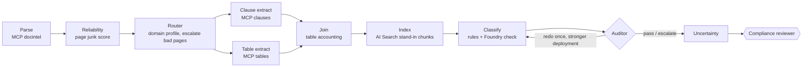

# Legal document compliance

Part of [azure-agent-labs](../../README.md). Full 17-section lab doc; output and code blocks are generated by `scripts/doc_drift.py`.

**Sections:** [1. Purpose](#1-purpose) · [2. Architecture](#2-architecture) · [3. How it works](#3-how-it-works) · [4. Key files](#4-key-files) · [5. Code excerpts](#5-code-excerpts) · [6. Configuration](#6-configuration) · [7. Commands](#7-commands) · [8. Real output](#8-real-output) · [9. Tests and eval gates](#9-tests-and-eval-gates) · [10. Guardrails](#10-guardrails) · [11. Security and governance](#11-security-and-governance) · [12. Observability](#12-observability) · [13. Failure modes](#13-failure-modes) · [14. Mapping to Azure services](#14-mapping-to-azure-services) · [15. Limitations](#15-limitations) · [16. Interview talking points](#16-interview-talking-points) · [17. Adopt this](#17-adopt-this)

## 1. Purpose

Contracts and policies are parsed into clauses and tables. Each page gets an OCR reliability score, each
clause a taxonomy label and an uncertainty score. A router and an auditor decide what is trustworthy
enough to show a compliance reviewer and what has to be redone or escalated.
Examples cover **banking** (term loan, KYC policy), **insurance** (property wording, claims standard) and
**healthcare** (business associate agreement, privacy notice). All documents are synthetic, and everything
runs offline with stand-ins (see the [root README](../../README.md#honest-note-on-mocks)).

## 2. Architecture



### Engineering layers

| Layer | Status | Where |
|---|---|---|
| Business understanding | implemented | reviewer-first workflow; nothing is signed, sent or deleted |
| Data understanding | implemented | layout JSON with OCR confidence, ragged tables, a deliberately bad scan (`data/`) |
| Knowledge engineering | implemented | clause taxonomy + lexicon, domain checklists (`classify.py`, `routing.py`) |
| Model engineering | implemented | tool comparison and choice rule (`model_selection.py`), two Foundry deployments |
| Context engineering | implemented | clause chunks indexed and retrieved per clause, only accepted pages reach extraction |
| Semantic engineering | implemented | Pydantic packets for layout, clauses, tables, reliability, classification |
| Agent engineering | implemented | router + auditor with handoffs, routing, regeneration, escalation |
| Loop engineering | implemented | auditor → classifier redo loop, bounded to one retry |
| Evaluation engineering | implemented | precision/recall gate, document quality, OCR confidence, uncertainty, compliance, reliability |
| Harness engineering | implemented | MCP gateway (identity, deny-list, retry, schema), step budget, tool deny-list |
| Infrastructure engineering | implemented (compile-only) | reusable MCP servers; `infra/main.bicep`: Document Intelligence, AI Search, Foundry, App Insights; Terraform twin in [`infra/terraform`](infra/terraform/README.md) |
| Continual learning | not in scope | reviewer outcomes are not fed back; see the wind-turbine lab |

### Infrastructure: reusable MCP servers

`mcp_servers.py` defines three small read-only servers (`docintel`, `clauses`, `tables`) on the `mcp` SDK.
Every call goes through `labcore.mcp_gateway.McpGateway`, which provides the audience and app-role check
with a mocked managed identity, a tool deny-list, retries on transient errors, and Pydantic validation of results.
The servers know nothing about the workflow, so another lab or agent can mount them unchanged.

## 3. How it works

### Agent engineering: responsibilities, handoffs, routing, regeneration, escalation

| Agent | Responsibility | Hands off to | Can |
|---|---|---|---|
| Reliability | score each page: OCR confidence, non-word ratio, symbol ratio → junk score; reject if junk > 0.35 or confidence < 0.6 | router | reject a page (reported, never silently skipped) |
| **Router** | detect domain from the text itself, flag a mismatch with the declared domain, pick the compliance profile | clause + table extractors (parallel) | send rejected pages straight to the escalation queue |
| Clause / table extractors | MCP tool calls through the gateway, which checks the managed identity (mocked) | join | queue ragged / low-confidence tables for review |
| Classifier | lexicon rules + Foundry (mocked) check, labels constrained to the taxonomy | auditor | disagree with the rules, which lowers confidence |
| **Auditor** | check labels, margins and the domain checklist of required clause types | classifier (redo) or uncertainty | request **one** regeneration on the second deployment (`clause-classifier-redo`), then escalate |
| Uncertainty | `1 − ocr_conf × min(1, 0.5 + margin) × (1 if model agrees else 0.6)`, per clause and per doc | reviewer (HITL) | mark clauses `needs_review` (> 0.35) |

Deny-listed tools on the Foundry writer: `*sign*`, `*execute_contract*`, `*send_to_counterparty*`, `*delete*`.

### Model engineering: tool comparison

Printed by `python -m legalcomp.model_selection`. Rows marked *measured* come from this repo's evals; rows marked
*mock* are illustrative placeholders and were not benchmarked.

| Capability | Candidate | Quality | p95 latency (s) | Cost / 1k pages (USD) | Source | Chosen |
|---|---|---|---|---|---|---|
| parsing | Document Intelligence prebuilt-layout | 0.97 | 2.5 | 10.0 | mock | yes |
| parsing | Document Intelligence prebuilt-read | 0.90 | 1.2 | 1.5 | mock |  |
| parsing | open-source OCR + heuristics | 0.78 | 4.0 | 0.4 | mock |  |
| ocr_quality | junk score (confidence + token shape) | 1.00 | 0.01 | 0.0 | measured | yes |
| ocr_quality | mean OCR confidence only | 0.83 | 0.01 | 0.0 | mock |  |
| reasoning | gpt-5-mini (DataZoneStandard) | 0.93 | 1.8 | 3.0 | mock | yes |
| reasoning | gpt-5 (DataZoneStandard) | 0.96 | 6.5 | 18.0 | mock |  |
| reasoning | small open model (serverless) | 0.81 | 1.1 | 0.8 | mock |  |
| legal_understanding | lexicon rules + gpt-5-mini check | 1.00 | 1.9 | 3.0 | measured | yes |
| legal_understanding | lexicon rules only | 1.00 | 0.01 | 0.0 | measured |  |
| legal_understanding | gpt-5-mini zero-shot | 0.88 | 1.8 | 3.0 | mock |  |

The choice rule is the best quality within latency and cost ceilings. Rules-only ties on quality here because the
synthetic documents are clean. The model check stays in the pipeline because it is what makes disagreement, and
therefore uncertainty, observable.

## 4. Key files

| File | What it does |
|---|---|
| `evals/run_eval.py` | eval gate over the gold sets in `evals/gold/`; exit 1 on regression |
| `data/gen_fixtures.py` | regenerates the synthetic data |
| `infra/main.bicep`, `infra/terraform/` | compile-only infrastructure |
| `tests/` | offline tests for this lab |

## 5. Code excerpts

The router that sends each page to the right extractor:

<!-- code: labs/legal-document-compliance/src/legalcomp/routing.py::route -->
```python
def route(layout: dict, reliability: list[dict]) -> dict:
    text = " ".join(ln["text"].lower() for p in layout["pages"] for ln in p["lines"])
    hits = {d: sum(text.count(t) for t in terms) for d, terms in DOMAIN_TERMS.items()}
    detected = max(hits, key=lambda d: hits[d])
    return {
        "declared_domain": layout["domain"],
        "detected_domain": detected,
        "domain_scores": hits,
        "mismatch": detected != layout["domain"],
        "profile": f"{detected}-clauses-v1",
        "escalated_pages": [r["page"] for r in reliability if not r["accepted"]],
    }
```
<!-- /code -->

Page reliability scoring that drives routing and redo:

<!-- code: labs/legal-document-compliance/src/legalcomp/reliability.py::score_page -->
```python
def score_page(page: dict) -> dict:
    lines = page["lines"][1:] or page["lines"]
    toks = [t for ln in lines for t in ln["text"].split()]
    chars = "".join(ln["text"] for ln in lines)
    mean_conf = sum(ln["confidence"] for ln in lines) / len(lines)
    non_word = sum(1 for t in toks if not WORD.match(t)) / (len(toks) or 1)
    symbol = sum(1 for c in chars if c in SYMBOLS) / (len(chars) or 1)
    junk = round(0.45 * (1 - mean_conf) + 0.4 * non_word + 0.15 * min(1.0, symbol * 5), 3)
    accepted = junk <= MAX_JUNK and mean_conf >= MIN_CONF
    reason = (
        ""
        if accepted
        else (
            f"junk score {junk} > {MAX_JUNK}"
            if junk > MAX_JUNK
            else f"mean OCR confidence {mean_conf:.2f} < {MIN_CONF}"
        )
    )
    return {
        "page": page["page"],
        "mean_confidence": round(mean_conf, 3),
        "non_word_ratio": round(non_word, 3),
        "symbol_ratio": round(symbol, 3),
        "junk_score": junk,
        "accepted": accepted,
        "reason": reason,
    }
```
<!-- /code -->

The workflow graph:

<!-- code: labs/legal-document-compliance/src/legalcomp/workflow.py::build_workflow -->
```python
def build_workflow(**deps) -> Workflow:
    parse, rel, router = Parse(**deps), Reliability(**deps), Router(**deps)
    ce, te, join = ClauseExtract(**deps), TableExtract(**deps), Join(**deps)
    idx, clf, aud = Index(**deps), Classify(**deps), Auditor(**deps)
    unc, gate = Uncertainty(**deps), ComplianceGate(**deps)
    return (
        WorkflowBuilder(
            start_executor=parse,
            name="legal-compliance",
            max_iterations=20,
            description="Contract/policy parsing with reliability scoring and reviewer sign-off",
        )
        .add_edge(parse, rel)
        .add_edge(rel, router)
        .add_fan_out_edges(router, [ce, te])
        .add_fan_in_edges([ce, te], join)
        .add_edge(join, idx)
        .add_edge(idx, clf)
        .add_edge(clf, aud)
        .add_switch_case_edge_group(
            aud,
            [
                Case(
                    condition=lambda s: isinstance(s, DocState) and s.audit.get("action") == "redo",
                    target=clf,
                ),
                Default(target=unc),
            ],
        )
        .add_edge(unc, gate)
        .build()
    )
```
<!-- /code -->

## 6. Configuration

| Setting | Effect |
|---|---|
| `LAB_MODE` | `offline` (default: mocks and stand-ins) or `azure` (stub adapters that raise `AdapterNotConfigured`; nothing is deployed) |
| `FOUNDRY_PROJECT_ENDPOINT`, `FOUNDRY_DATA_ZONE` | Foundry project and DataZoneStandard zone (default `us`), checked by `ZonePolicy` |
| `AZURE_CLIENT_ID` | user-assigned managed identity for the MCP gateway |
| `APPLICATIONINSIGHTS_CONNECTION_STRING`, `LAB_TRACE_CONSOLE` | trace export |
| `data/documents/*.json` | synthetic contracts and policies (layout output shape) |
| `model_selection.py` candidates | tool comparison used to pick the extractor |

## 7. Commands

```bash
pytest -q labs/legal-document-compliance
python labs/legal-document-compliance/evals/run_eval.py --out evals-out
python -m legalcomp.model_selection        # with labs/legal-document-compliance/src on PYTHONPATH
```

## 8. Real output

`evals/run_eval.py` on the gold sets (offline, deterministic):

<!-- output: python labs/legal-document-compliance/evals/run_eval.py --out evals-out -->
```text
{
  "lab": "legal-document-compliance",
  "passed": true,
  "metrics": {
    "clause_precision": 1.0,
    "clause_recall": 1.0,
    "label_accuracy": 1.0,
    "tables_accounted": 1.0,
    "junk_page_recall": 1.0,
    "false_page_rejects": 0.0,
    "audit_pass_rate": 1.0,
    "compliance_checks_passed": 1.0,
    "mean_ocr_confidence": 0.9655,
    "mean_uncertainty": 0.2123,
    "banking_precision": 1.0,
    "banking_recall": 1.0,
    "healthcare_precision": 1.0,
    "healthcare_recall": 1.0,
    "insurance_precision": 1.0,
    "insurance_recall": 1.0
  },
  "thresholds": [
    "clause_precision >= 0.95",
    "clause_recall >= 0.95",
    "label_accuracy >= 0.9",
    "tables_accounted >= 1.0",
    "junk_page_recall >= 1.0",
    "false_page_rejects <= 0",
    "audit_pass_rate >= 1.0",
    "compliance_checks_passed >= 1.0"
  ],
  "failures": []
}
report: evals-out/legal-document-compliance.json
```
<!-- /output -->

## 9. Tests and eval gates

### Evaluation (`evals/run_eval.py`)

| Metric | What it measures | Threshold | Current |
|---|---|---|---|
| clause_precision / clause_recall | clause ids vs gold set (6 documents) | ≥ 0.95 | 1.0 / 1.0 |
| label_accuracy | taxonomy label on matched clauses | ≥ 0.9 | 1.0 |
| tables_accounted | each table is either extracted or queued | = 1.0 | 1.0 |
| junk_page_recall / false_page_rejects | **document quality**: the bad scan is rejected, clean pages are kept | = 1.0 / = 0 | 1.0 / 0 |
| audit_pass_rate | **output reliability**: the auditor accepted without escalation | = 1.0 | 1.0 |
| compliance_checks_passed | **compliance checks**: required clause types present per domain | = 1.0 | 1.0 |
| mean_ocr_confidence | **OCR confidence** (reported) | – | 0.966 |
| mean_uncertainty | **uncertainty** profile (reported) | – | 0.212 |

Per-domain precision and recall (banking, insurance, healthcare) are also reported.

### Tests

<!-- output: python -m pytest --co -q -p no:cacheprovider labs/legal-document-compliance | grep '::' -->
```text
labs/legal-document-compliance/tests/test_legal_components.py::test_mcp_servers_expose_small_read_only_surfaces
labs/legal-document-compliance/tests/test_legal_components.py::test_gateway_validates_layout_packet
labs/legal-document-compliance/tests/test_legal_components.py::test_identity_without_role_is_refused
labs/legal-document-compliance/tests/test_legal_components.py::test_unknown_document_is_a_tool_error
labs/legal-document-compliance/tests/test_legal_components.py::test_junk_page_rejected_clean_page_accepted
labs/legal-document-compliance/tests/test_legal_components.py::test_clauses_never_stitched_across_rejected_page
labs/legal-document-compliance/tests/test_legal_components.py::test_ragged_table_goes_to_review_not_dropped
labs/legal-document-compliance/tests/test_legal_components.py::test_table_on_rejected_page_goes_to_review
labs/legal-document-compliance/tests/test_legal_components.py::test_rule_labels[KNOW YOUR CUSTOMER AND ANTI-MONEY LAUNDERING-beneficial ownership-kyc_aml]
labs/legal-document-compliance/tests/test_legal_components.py::test_rule_labels[BREACH NOTIFICATION-notify within 10 days-breach_notification]
labs/legal-document-compliance/tests/test_legal_components.py::test_rule_labels[LIMITS OF LIABILITY-total liability will not exceed-limitation_of_liability]
labs/legal-document-compliance/tests/test_legal_components.py::test_rule_labels[DEFINITIONS-Borrower means Alder Tools-other]
labs/legal-document-compliance/tests/test_legal_components.py::test_taxonomy_is_closed_and_includes_other
labs/legal-document-compliance/tests/test_legal_components.py::test_clause_chunks_indexed_and_searchable
labs/legal-document-compliance/tests/test_legal_router_auditor.py::test_router_detects_domain_from_text_for_every_document
labs/legal-document-compliance/tests/test_legal_router_auditor.py::test_router_flags_declared_domain_mismatch_and_escalates_pages
labs/legal-document-compliance/tests/test_legal_router_auditor.py::test_auditor_compliance_checklist_finds_missing_clause
labs/legal-document-compliance/tests/test_legal_router_auditor.py::test_auditor_requests_redo_and_second_deployment_fixes_labels
labs/legal-document-compliance/tests/test_legal_router_auditor.py::test_auditor_escalates_when_redo_also_disagrees
labs/legal-document-compliance/tests/test_legal_router_auditor.py::test_model_selection_respects_ceilings_and_marks_mock_scores
labs/legal-document-compliance/tests/test_legal_workflow.py::test_banking_contract_end_to_end
labs/legal-document-compliance/tests/test_legal_workflow.py::test_healthcare_junk_page_forces_review_items
labs/legal-document-compliance/tests/test_legal_workflow.py::test_reviewer_relabel_and_no_write_back
labs/legal-document-compliance/tests/test_legal_workflow.py::test_model_label_outside_taxonomy_is_rejected
labs/legal-document-compliance/tests/test_legal_workflow.py::test_dropped_table_would_fail_loudly
labs/legal-document-compliance/tests/test_legal_workflow.py::test_eval_gate_passes_all_domains
labs/legal-document-compliance/tests/test_legal_workflow.py::test_gate_fails_when_clause_ids_drift
labs/legal-document-compliance/tests/test_legal_workflow.py::test_agent_card_current
labs/legal-document-compliance/tests/test_legal_workflow.py::test_bicep_compiles
```
<!-- /output -->

## 10. Guardrails

- The system never signs, sends or deletes a document; those tools do not exist and are deny-listed.
- The auditor can send clauses back for one regeneration (on the second deployment) or escalate; it cannot approve.
- Low-reliability pages are routed to stricter extraction or flagged as uncertain.

## 11. Security and governance

- MCP servers (layout, clauses, tables) are reached through the managed-identity gateway.
- Reviewer decisions are recorded with the clause ids they cover.
- Documents are synthetic; no client data.
- The agent card in `control-plane/agent-cards/` is generated by `scripts/export_agent_cards.py`; CI fails if it drifts.

## 12. Observability

Spans per executor; routing decisions and audit verdicts are part of the run state and the eval report.

## 13. Failure modes

| Failure | What happens |
|---|---|
| OCR junk on a page | reliability score drops, page routed and flagged (`ocr junk recall` gate) |
| table extraction fails | `TablesDropped` recorded, reviewer sees it |
| auditor rejects classification | one redo, then escalate |

## 14. Mapping to Azure services

| Piece | Azure service |
|---|---|
| layout and tables | Azure AI Document Intelligence |
| clause index | Azure AI Search |
| MCP servers | Azure Container Apps |
| classification text | Foundry deployment |
| storage | Azure Storage |
| traces | Application Insights |

All of these are declared in `infra/main.bicep` (and the Terraform twin) and compile in CI; none is deployed.

## 15. Limitations

* The documents are six short synthetic files, already in layout-JSON form. Real PDFs, scanned handwriting and long
  schedules are out of scope, and perfect scores here do not predict real-world precision.
* The clause taxonomy is small and the lexicon is hand-written. It is not legal advice and not a substitute for counsel.

## 16. Interview talking points

### Domains you learn

Legal document understanding · OCR + parsing reliability · compliance-aware workflows · uncertainty profiling · multi-agent routing & audit · reusable MCP tools

### Transferable domains

Legal operations · compliance & RegTech · insurance claims · contract management · financial risk & AML · government & public sector

## 17. Adopt this

1. Point `extract.analyze_layout` at Document Intelligence output for your documents.
2. Add clause labels and gold clauses to `evals/gold/clauses.jsonl`.
3. Keep the auditor and the reviewer gate; never add a sign or send tool.
4. Reuse the shared layer (`shared/labcore`): config switch, MCP gateway, middleware, Foundry zone policy, eval gate. See [docs/adopt-this.md](../../docs/adopt-this.md).
