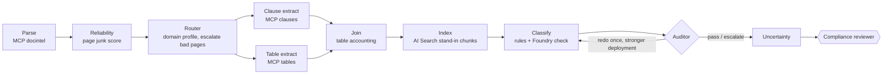

# Legal document compliance

Contracts and policies are parsed into clauses and tables. Each page gets an OCR reliability score, each
clause a taxonomy label and an uncertainty score. A router and an auditor decide what is trustworthy
enough to show a compliance reviewer and what has to be redone or escalated.
Examples cover **banking** (term loan, KYC policy), **insurance** (property wording, claims standard) and
**healthcare** (business associate agreement, privacy notice). All documents are synthetic, and everything
runs offline with stand-ins (see the [root README](../../README.md#honest-note-on-mocks)).

## Flow



## Agent engineering: responsibilities, handoffs, routing, regeneration, escalation

| Agent | Responsibility | Hands off to | Can |
|---|---|---|---|
| Reliability | score each page: OCR confidence, non-word ratio, symbol ratio → junk score; reject if junk > 0.35 or confidence < 0.6 | router | reject a page (reported, never silently skipped) |
| **Router** | detect domain from the text itself, flag a mismatch with the declared domain, pick the compliance profile | clause + table extractors (parallel) | send rejected pages straight to the escalation queue |
| Clause / table extractors | MCP tool calls through the gateway, which checks the managed identity (mocked) | join | queue ragged / low-confidence tables for review |
| Classifier | lexicon rules + Foundry (mocked) check, labels constrained to the taxonomy | auditor | disagree with the rules, which lowers confidence |
| **Auditor** | check labels, margins and the domain checklist of required clause types | classifier (redo) or uncertainty | request **one** regeneration on the second deployment (`clause-classifier-redo`), then escalate |
| Uncertainty | `1 − ocr_conf × min(1, 0.5 + margin) × (1 if model agrees else 0.6)`, per clause and per doc | reviewer (HITL) | mark clauses `needs_review` (> 0.35) |

Deny-listed tools on the Foundry writer: `*sign*`, `*execute_contract*`, `*send_to_counterparty*`, `*delete*`.

## Model engineering: tool comparison

Printed by `python -m legalcomp.model_selection`. Rows marked *measured* come from this repo's evals; rows marked
*mock* are illustrative placeholders and were not benchmarked.

| Capability | Candidate | Quality | p95 latency (s) | Cost / 1k pages (USD) | Source | Chosen |
|---|---|---|---|---|---|---|
| parsing | Document Intelligence prebuilt-layout | 0.97 | 2.5 | 10.0 | mock | yes |
| parsing | Document Intelligence prebuilt-read | 0.90 | 1.2 | 1.5 | mock |  |
| parsing | open-source OCR + heuristics | 0.78 | 4.0 | 0.4 | mock |  |
| ocr_quality | junk score (confidence + token shape) | 1.00 | 0.01 | 0.0 | measured | yes |
| ocr_quality | mean OCR confidence only | 0.83 | 0.01 | 0.0 | mock |  |
| reasoning | gpt-5-mini (DataZoneStandard) | 0.93 | 1.8 | 3.0 | mock | yes |
| reasoning | gpt-5 (DataZoneStandard) | 0.96 | 6.5 | 18.0 | mock |  |
| reasoning | small open model (serverless) | 0.81 | 1.1 | 0.8 | mock |  |
| legal_understanding | lexicon rules + gpt-5-mini check | 1.00 | 1.9 | 3.0 | measured | yes |
| legal_understanding | lexicon rules only | 1.00 | 0.01 | 0.0 | measured |  |
| legal_understanding | gpt-5-mini zero-shot | 0.88 | 1.8 | 3.0 | mock |  |

The choice rule is the best quality within latency and cost ceilings. Rules-only ties on quality here because the
synthetic documents are clean. The model check stays in the pipeline because it is what makes disagreement, and
therefore uncertainty, observable.

## Infrastructure: reusable MCP servers

`mcp_servers.py` defines three small read-only servers (`docintel`, `clauses`, `tables`) on the `mcp` SDK.
Every call goes through `labcore.mcp_gateway.McpGateway`, which provides the audience and app-role check
with a mocked managed identity, a tool deny-list, retries on transient errors, and Pydantic validation of results.
The servers know nothing about the workflow, so another lab or agent can mount them unchanged.

## Evaluation (`evals/run_eval.py`)

| Metric | What it measures | Threshold | Current |
|---|---|---|---|
| clause_precision / clause_recall | clause ids vs gold set (6 documents) | ≥ 0.95 | 1.0 / 1.0 |
| label_accuracy | taxonomy label on matched clauses | ≥ 0.9 | 1.0 |
| tables_accounted | each table is either extracted or queued | = 1.0 | 1.0 |
| junk_page_recall / false_page_rejects | **document quality**: the bad scan is rejected, clean pages are kept | = 1.0 / = 0 | 1.0 / 0 |
| audit_pass_rate | **output reliability**: the auditor accepted without escalation | = 1.0 | 1.0 |
| compliance_checks_passed | **compliance checks**: required clause types present per domain | = 1.0 | 1.0 |
| mean_ocr_confidence | **OCR confidence** (reported) | – | 0.966 |
| mean_uncertainty | **uncertainty** profile (reported) | – | 0.212 |

Per-domain precision and recall (banking, insurance, healthcare) are also reported.

## Engineering layers

| Layer | Status | Where |
|---|---|---|
| Business understanding | implemented | reviewer-first workflow; nothing is signed, sent or deleted |
| Data understanding | implemented | layout JSON with OCR confidence, ragged tables, a deliberately bad scan (`data/`) |
| Knowledge engineering | implemented | clause taxonomy + lexicon, domain checklists (`classify.py`, `routing.py`) |
| Model engineering | implemented | tool comparison and choice rule (`model_selection.py`), two Foundry deployments |
| Context engineering | implemented | clause chunks indexed and retrieved per clause, only accepted pages reach extraction |
| Semantic engineering | implemented | Pydantic packets for layout, clauses, tables, reliability, classification |
| Agent engineering | implemented | router + auditor with handoffs, routing, regeneration, escalation |
| Loop engineering | implemented | auditor → classifier redo loop, bounded to one retry |
| Evaluation engineering | implemented | precision/recall gate, document quality, OCR confidence, uncertainty, compliance, reliability |
| Harness engineering | implemented | MCP gateway (identity, deny-list, retry, schema), step budget, tool deny-list |
| Infrastructure engineering | implemented (compile-only) | reusable MCP servers; `infra/main.bicep`: Document Intelligence, AI Search, Foundry, App Insights |
| Continual learning | not in scope | reviewer outcomes are not fed back; see the wind-turbine lab |

## Domains you learn

Legal document understanding · OCR + parsing reliability · compliance-aware workflows · uncertainty profiling · multi-agent routing & audit · reusable MCP tools

## Transferable domains

Legal operations · compliance & RegTech · insurance claims · contract management · financial risk & AML · government & public sector

## Run

```bash
pytest -q labs/legal-document-compliance
python labs/legal-document-compliance/evals/run_eval.py --out evals-out
python -m legalcomp.model_selection        # with labs/legal-document-compliance/src on PYTHONPATH
```

## Limitations

* The documents are six short synthetic files, already in layout-JSON form. Real PDFs, scanned handwriting and long
  schedules are out of scope, and perfect scores here do not predict real-world precision.
* The clause taxonomy is small and the lexicon is hand-written. It is not legal advice and not a substitute for counsel.
