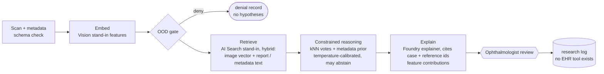

# Medical eye-scan multimodal triage (research demo)

> ⚠️ **NOT A MEDICAL DEVICE - research demo on synthetic data; not for clinical use.**
> No real patient data, no clinical validation, no EHR write-back. Every report carries this banner.

Scans → RAG → Reasoning → Explain. A synthetic 16×16 retinal array plus patient metadata becomes
calibrated, case-cited disease *hypotheses* for an ophthalmologist to review. Out-of-distribution
input is denied before any reasoning. Everything runs offline against local stand-ins; nothing is deployed
(see the [root README](../../README.md#honest-note-on-mocks)).

## Flow



| Step | Code | Notes |
|---|---|---|
| Intake | `workflow.ScanIntake`, `models.Scan` | Pydantic schema: modality, shape, age, IOP, diabetes |
| Embed | `vision.VisionStandIn`, `knowledge.CaseLibrary.embed` | cup ratio, specks, dark dots, macula specks, background noise, z-scored against the library |
| OOD gate | `knowledge.OodGate` | denies wrong modality, wrong size, blank images, and anything beyond 1.5× the library's largest nearest-neighbour distance |
| Retrieve | `knowledge.CaseLibrary.similar / references` | BM25 over report + metadata text fused with vector cosine (RRF) |
| Reason | `reasoning.Reasoner` | labels restricted to `normal / diabetic_retinopathy / glaucoma / amd`; a hypothesis is offered only if a retrieved labeled case supports it; confidence is temperature-scaled on a separate calibration split; abstains below 0.5 |
| Explain | `explainer.py` | Foundry (mocked) writer. The output is validated: banner present, only retrieved case ids cited, EHR/FHIR/order/prescribe tools deny-listed |
| Review | `workflow.OphthalmologistGate` | MAF `request_info`. The reader can confirm or override, and the result goes to a research log |

## Explainability

The report includes **per-feature contribution scores** for the top hypothesis. The score explained is the
calibrated log-odds of that label. The baseline is the library's mean feature vector. SHAP (KernelExplainer)
is used when the `shap` package is installed; otherwise a deterministic ablation importance: reset one
feature to baseline, re-run retrieval and reasoning, and measure the change. Example: `dark_dots +0.228 (ablation)`.

It also produced an honest finding: on several cases `background_std` is among the top contributors. That
feature is meant to measure image noise, but it is computed over the whole background, so specks and dots
raise it too. It acts as a correlated proxy for lesions rather than an independent signal. That is the kind
of shortcut contribution scores exist to surface, and a reason to engineer features more carefully before any real use.

## Eval gate (`evals/run_eval.py`)

| Metric | Threshold | Current |
|---|---|---|
| top1_accuracy vs synthetic labels (32 held-out cases) | ≥ 0.85 | 0.969 |
| expected calibration error | ≤ 0.15 | 0.029 |
| ood_deny_rate (4 OOD cases) | = 1.0 | 1.0 |
| false_deny_rate (in-distribution denied) | ≤ 0.05 | 0.0 |
| citation_validity (cited ids ⊆ retrieved) | = 1.0 | 1.0 |
| ehr_writes | = 0 | 0 |

## Engineering layers

| Layer | Status | Where |
|---|---|---|
| Business understanding | implemented | research triage for a reader, never a diagnosis; banner + no write-back as requirements |
| Data understanding | implemented | synthetic generator with overlapping classes and artifacts (`data/gen_fixtures.py`), feature statistics |
| Knowledge engineering | implemented | labeled case library + reference notes indexed for hybrid retrieval (`knowledge.py`) |
| Model engineering | implemented | handcrafted vision features, kNN voting, temperature calibration (`vision.py`, `reasoning.py`) |
| Context engineering | implemented | metadata turned into retrieval text and small prior nudges; only retrieved ids reach the explainer |
| Semantic engineering | implemented | fixed label set, Pydantic `Hypothesis` / `ExplanationReport` |
| Agent engineering | implemented | MAF graph of intake, embed, retrieve, reason, explain and review executors |
| Loop engineering | not in scope | single pass per scan; reader overrides are logged, not fed back |
| Evaluation engineering | implemented | accuracy, ECE, OOD deny, false deny, citation validity, EHR writes |
| Harness engineering | implemented | OOD gate, abstain threshold, deny-listed tools, output validation with fallback |
| Infrastructure engineering | implemented (compile-only) | `infra/main.bicep`: AI Search, Storage, App Insights, Foundry vision deployment |
| Continual learning | not in scope | the case library is static; see the wind-turbine lab |

## Domains you learn

Medical imaging · multimodal RAG · disease detection · explainable AI · clinical reasoning · evaluation & safety

## Transferable domains

Ophthalmology AI · radiology AI · pathology AI · healthcare diagnostics · clinical trials · medical risk

## Run

```bash
pytest -q labs/medical-eye-scan-multimodal
python labs/medical-eye-scan-multimodal/evals/run_eval.py --out evals-out
```

## Limitations

* The images are 16×16 synthetic arrays with handcrafted features, not fundus photographs. The metrics show the harness works; they say nothing about clinical accuracy.
* Calibration is fitted on a small synthetic split. Real deployment would need prospective validation, subgroup analysis and regulatory review, none of which is attempted here.
