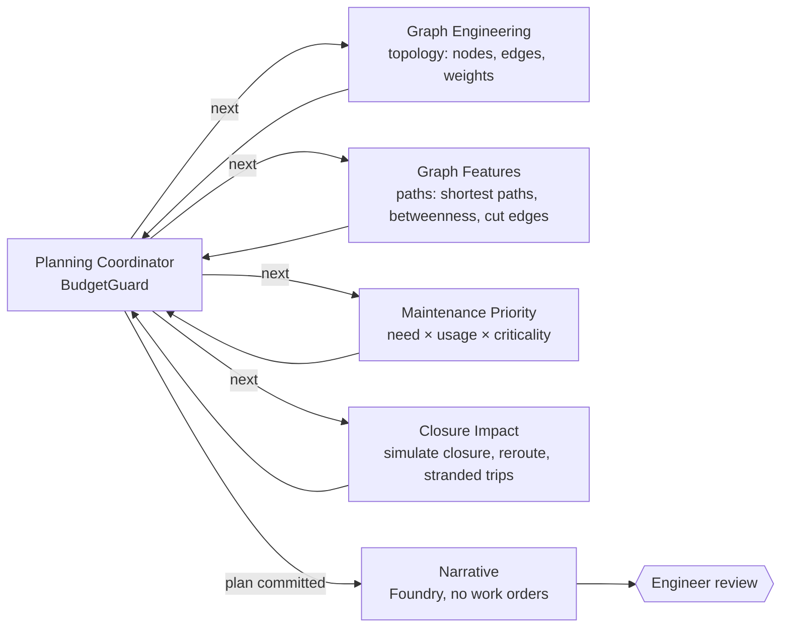

# Road network maintenance on a graph

A city road network is a graph, not a list of potholes. This lab builds an OSM-style network in NetworkX,
enriches it with condition, maintenance and incident data, and has a Planning Coordinator drive four
graph agents: **topology → paths → priority → impact**. The result is a budget-constrained maintenance plan,
a closure-impact analysis and a road-health report. Foundry (mocked) writes the narrative, and an engineer
approves the plan. All data is synthetic and all services are offline stand-ins (see the [root README](../../README.md#honest-note-on-mocks)).

## Flow



## Data sources (synthetic, `data/gen_fixtures.py`)

| Source | File | Content |
|---|---|---|
| OSM-style network | `city_osm.json` | 22 nodes, 31 ways (tags: highway class, max speed, bridge) with a river and two bridges |
| Road condition | `defects.json` | PCI, potholes, last resurfacing year, repair cost and days |
| Maintenance records | `maintenance_records.json` | failed patches per segment |
| Closures / incidents | `incidents.json`, `evals/gold/closures.jsonl` | incident counts; historical closures with observed detours and stranded trips |
| Travel demand | `demand.json` | origin-destination trips, including critical trips to the hospital |

## Agents

| Agent | Layer | Does |
|---|---|---|
| Planning Coordinator | control | chooses the next worker, enforces the worker-call budget, commits the plan only through `BudgetGuard` |
| Graph Engineering | topology | OSM → `nx.Graph`, with haversine lengths and travel minutes as edge weights; merges defects, records and incidents |
| Graph Features | paths | all-pairs demand routing, edge usage, betweenness centrality, cut edges (bridges in the graph-theory sense), trips served if cut |
| Maintenance Priority | priority | `need × (0.15 + 0.45·usage + 0.40·criticality)`. A busy bridge can outrank a pothole-ridden dead end |
| Closure Impact | impact | removes a segment, reroutes every trip, and reports extra vehicle-minutes, stranded trips, hospital access and affected segments; staging rules (night work, bridges in different weeks) |

What-if closures (`PlanningDesk.plan(what_if=[...])`) run the same impact agent on segments outside the plan.

## Outputs

* **Maintenance plan:** segments within budget with cost, week and staging notes. Items that were skipped are listed with a reason.
* **Closure impact:** per segment, extra vehicle-minutes, stranded trips, hospital access lost, and rerouted segments.
* **Road health report:** PCI bands, mean PCI, cut edges, river crossings, segments with incidents, and the most central segments.
* **Narrative:** Foundry (mocked) text checked against the plan. Work-order, road-closure and dispatch tools are deny-listed.

## Evaluation (`evals/run_eval.py`)

| Metric | Question | Threshold | Current |
|---|---|---|---|
| route_quality | are shortest paths optimal and valid walks? (5 gold routes) | = 1.0 | 1.0 |
| detour_within_15pct | closure impact vs 7 historical closures (±15% or 10 veh-min) | = 1.0 | 1.0 |
| disconnection / hospital_access / stranded_trips accuracy | exact match per closure | = 1.0 | 1.0 |
| pairwise_order_accuracy | planner-approved "A outranks B" pairs (**maintenance priority**) | = 1.0 | 1.0 |
| must_fix_included / plan_above_median | **recommendation usefulness** at $400k | = 1.0 | 1.0 |
| budget_respected | plan ≤ budget at several budgets; the guard raises on overspend | = 1.0 | 1.0 |
| no_work_orders | nothing is dispatched | = 1.0 | 1.0 |

## Engineering layers

| Layer | Status | Where |
|---|---|---|
| Business understanding | implemented | budgeted plan an engineer signs off; hospital access and bridge staging as hard concerns |
| Data understanding | **implemented (emphasis)** | four data sources merged onto edges; haversine distances; stranded vs rerouted trips kept separate (`graph_ops.build_graph`) |
| Knowledge engineering | **implemented (emphasis)** | the road network *is* the knowledge graph: topology, attributes, centrality, cut edges |
| Model engineering | implemented | transparent scoring model (need, usage, criticality) instead of a black box |
| Context engineering | **implemented (emphasis)** | the coordinator passes each agent only the state it needs; the NetworkX graph stays in the per-run runtime, not in messages |
| Semantic engineering | implemented | Pydantic `PlanRequest` / `PlanState` / `EngineerReview` / `PlanNarrative` |
| Agent engineering | implemented | coordinator + four workers on MAF with conditional routing |
| Loop engineering | implemented | coordinator ↔ worker loop, bounded by the worker-call budget |
| Evaluation engineering | **implemented (emphasis)** | route quality, maintenance priority, closure impact, recommendation usefulness |
| Harness engineering | implemented | `BudgetGuard` (money, worker calls, staging), deny-listed tools, step budget |
| Infrastructure engineering | implemented (compile-only) | `infra/main.bicep`: Container Apps environment, Storage, App Insights, Foundry; Terraform twin in [`infra/terraform`](infra/terraform/README.md) |
| Continual learning | not in scope | historical closures are used for evaluation, not for updating weights |

## Domains you learn

Graph analytics · network routing · infrastructure asset management · budget-constrained planning · impact simulation · decision support

## Transferable domains

Transport & mobility · utilities networks · logistics & supply chain · telecom networks · smart cities · emergency access planning

## Run

```bash
pytest -q labs/road-network-maintenance-graph
python labs/road-network-maintenance-graph/evals/run_eval.py --out evals-out
```

## Limitations

* The network has 22 nodes and 31 ways, with synthetic demand. Real OSM extracts need turn restrictions, one-way streets and time-of-day demand, none of which is modeled.
* The priority weights are hand-set and checked against a few planner-approved pairs, not fitted.
