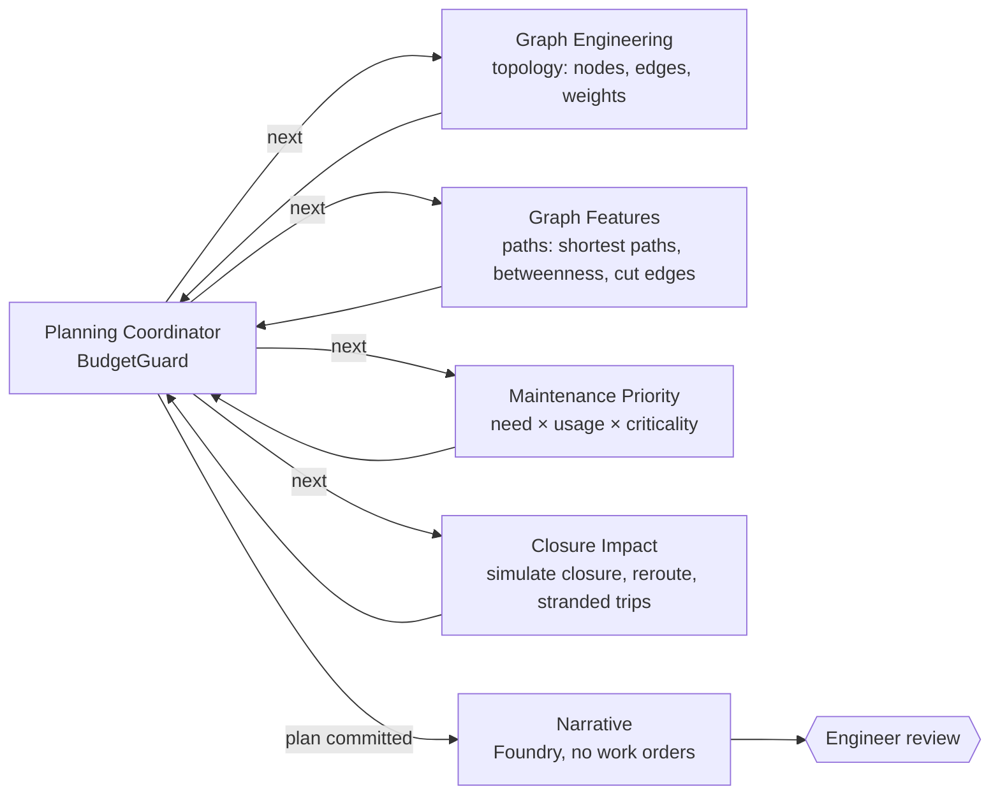

# Road network maintenance on a graph

Part of [azure-agent-labs](../../README.md). Full 17-section lab doc; output and code blocks are generated by `scripts/doc_drift.py`.

**Sections:** [1. Purpose](#1-purpose) · [2. Architecture](#2-architecture) · [3. How it works](#3-how-it-works) · [4. Key files](#4-key-files) · [5. Code excerpts](#5-code-excerpts) · [6. Configuration](#6-configuration) · [7. Commands](#7-commands) · [8. Real output](#8-real-output) · [9. Tests and eval gates](#9-tests-and-eval-gates) · [10. Guardrails](#10-guardrails) · [11. Security and governance](#11-security-and-governance) · [12. Observability](#12-observability) · [13. Failure modes](#13-failure-modes) · [14. Mapping to Azure services](#14-mapping-to-azure-services) · [15. Limitations](#15-limitations) · [16. Interview talking points](#16-interview-talking-points) · [17. Adopt this](#17-adopt-this)

## 1. Purpose

A city road network is a graph, not a list of potholes. This lab builds an OSM-style network in NetworkX,
enriches it with condition, maintenance and incident data, and has a Planning Coordinator drive four
graph agents: **topology → paths → priority → impact**. The result is a budget-constrained maintenance plan,
a closure-impact analysis and a road-health report. Foundry (mocked) writes the narrative, and an engineer
approves the plan. All data is synthetic and all services are offline stand-ins (see the [root README](../../README.md#honest-note-on-mocks)).

## 2. Architecture



### Engineering layers

| Layer | Status | Where |
|---|---|---|
| Business understanding | implemented | budgeted plan an engineer signs off; hospital access and bridge staging as hard concerns |
| Data understanding | **implemented (emphasis)** | four data sources merged onto edges; haversine distances; stranded vs rerouted trips kept separate (`graph_ops.build_graph`) |
| Knowledge engineering | **implemented (emphasis)** | the road network *is* the knowledge graph: topology, attributes, centrality, cut edges |
| Model engineering | implemented | transparent scoring model (need, usage, criticality) instead of a black box |
| Context engineering | **implemented (emphasis)** | the coordinator passes each agent only the state it needs; the NetworkX graph stays in the per-run runtime, not in messages |
| Semantic engineering | implemented | Pydantic `PlanRequest` / `PlanState` / `EngineerReview` / `PlanNarrative` |
| Agent engineering | implemented | coordinator + four workers on MAF with conditional routing |
| Loop engineering | implemented | coordinator ↔ worker loop, bounded by the worker-call budget |
| Evaluation engineering | **implemented (emphasis)** | route quality, maintenance priority, closure impact, recommendation usefulness |
| Harness engineering | implemented | `BudgetGuard` (money, worker calls, staging), deny-listed tools, step budget |
| Infrastructure engineering | implemented (compile-only) | `infra/main.bicep`: Container Apps environment, Storage, App Insights, Foundry; Terraform twin in [`infra/terraform`](infra/terraform/README.md) |
| Continual learning | not in scope | historical closures are used for evaluation, not for updating weights |

### Data sources (synthetic, `data/gen_fixtures.py`)

| Source | File | Content |
|---|---|---|
| OSM-style network | `city_osm.json` | 22 nodes, 31 ways (tags: highway class, max speed, bridge) with a river and two bridges |
| Road condition | `defects.json` | PCI, potholes, last resurfacing year, repair cost and days |
| Maintenance records | `maintenance_records.json` | failed patches per segment |
| Closures / incidents | `incidents.json`, `evals/gold/closures.jsonl` | incident counts; historical closures with observed detours and stranded trips |
| Travel demand | `demand.json` | origin-destination trips, including critical trips to the hospital |

## 3. How it works

### Agents

| Agent | Layer | Does |
|---|---|---|
| Planning Coordinator | control | chooses the next worker, enforces the worker-call budget, commits the plan only through `BudgetGuard` |
| Graph Engineering | topology | OSM → `nx.Graph`, with haversine lengths and travel minutes as edge weights; merges defects, records and incidents |
| Graph Features | paths | all-pairs demand routing, edge usage, betweenness centrality, cut edges (bridges in the graph-theory sense), trips served if cut |
| Maintenance Priority | priority | `need × (0.15 + 0.45·usage + 0.40·criticality)`. A busy bridge can outrank a pothole-ridden dead end |
| Closure Impact | impact | removes a segment, reroutes every trip, and reports extra vehicle-minutes, stranded trips, hospital access and affected segments; staging rules (night work, bridges in different weeks) |

What-if closures (`PlanningDesk.plan(what_if=[...])`) run the same impact agent on segments outside the plan.

### Outputs

* **Maintenance plan:** segments within budget with cost, week and staging notes. Items that were skipped are listed with a reason.
* **Closure impact:** per segment, extra vehicle-minutes, stranded trips, hospital access lost, and rerouted segments.
* **Road health report:** PCI bands, mean PCI, cut edges, river crossings, segments with incidents, and the most central segments.
* **Narrative:** Foundry (mocked) text checked against the plan. Work-order, road-closure and dispatch tools are deny-listed.

## 4. Key files

| File | What it does |
|---|---|
| `evals/run_eval.py` | eval gate over the gold sets in `evals/gold/`; exit 1 on regression |
| `data/gen_fixtures.py` | regenerates the synthetic data |
| `infra/main.bicep`, `infra/terraform/` | compile-only infrastructure |
| `tests/` | offline tests for this lab |

## 5. Code excerpts

The budget guard that stops over-spend:

<!-- code: labs/road-network-maintenance-graph/src/roadgraph/harness.py::BudgetGuard -->
```python
@dataclass
class BudgetGuard:
    budget_usd: float
    max_worker_calls: int = 12
    worker_calls: int = 0
    committed_usd: float = 0.0
    ledger: list[dict] = field(default_factory=list)

    def worker(self, name: str) -> None:
        self.worker_calls += 1
        if self.worker_calls > self.max_worker_calls:
            raise BudgetExceeded(f"worker budget {self.max_worker_calls} exceeded at {name}")

    def commit(self, item: dict) -> None:
        if self.committed_usd + item["cost_usd"] > self.budget_usd + 1e-6:
            raise BudgetExceeded(
                f"{item['segment_id']}: ${item['cost_usd']:,} would exceed budget ${self.budget_usd:,.0f}"
            )
        self.committed_usd += item["cost_usd"]
        self.ledger.append({"segment_id": item["segment_id"], "cost_usd": item["cost_usd"]})

    @property
    def remaining(self) -> float:
        return self.budget_usd - self.committed_usd
```
<!-- /code -->

Closure impact on travel time:

<!-- code: labs/road-network-maintenance-graph/src/roadgraph/graph_ops.py::closure_impact -->
```python
def closure_impact(g: nx.Graph, seg: str, dem: list[dict], base: list[float | None] | None = None) -> dict:
    base = base if base is not None else trip_minutes(g, dem)
    h = g.copy()
    h.remove_edge(*edge_by_id(g, seg))
    closed = trip_minutes(h, dem)
    extra = sum(c - b for c, b in zip(closed, base, strict=True) if c is not None and b is not None)
    stranded = [d for d, c in zip(dem, closed, strict=True) if c is None]
    reroutes = []
    for d in dem:
        if d["critical"] and nx.has_path(h, d["origin"], d["dest"]):
            old = nx.shortest_path(g, d["origin"], d["dest"], weight="minutes")
            new = nx.shortest_path(h, d["origin"], d["dest"], weight="minutes")
            if old != new:
                reroutes.append({"origin": d["origin"], "dest": d["dest"], "new_path": new})
    return {
        "segment_id": seg,
        "affected_segments": affected_segments(g, h, dem),
        "critical_reroutes": reroutes,
        "extra_vehicle_minutes": round(extra, 1),
        "stranded_trips": sum(d["trips"] for d in stranded),
        "disconnected": not nx.is_connected(h),
        "hospital_access_lost": any(d["dest"] == "E2" for d in stranded),
        "critical_trips_stranded": sum(d["trips"] for d in stranded if d["critical"]),
    }
```
<!-- /code -->

The workflow graph:

<!-- code: labs/road-network-maintenance-graph/src/roadgraph/workflow.py::build_workflow -->
```python
def build_workflow(**deps) -> Workflow:
    deps.setdefault("runtime", {})
    coord = PlanningCoordinator(**deps)
    agents = {
        a.node: a
        for a in (
            GraphEngineering(**deps),
            GraphFeatures(**deps),
            MaintenancePriority(**deps),
            ClosureImpact(**deps),
        )
    }
    narr, gate = Narrative(**deps), EngineerGate(**deps)
    b = WorkflowBuilder(
        start_executor=coord,
        name="road-maintenance",
        max_iterations=40,
        description="Planning coordinator and graph agents under a budget harness",
    )
    b = b.add_switch_case_edge_group(
        coord,
        [
            Case(condition=(lambda s, n=n: isinstance(s, PlanState) and s.next == n), target=a)
            for n, a in agents.items()
        ]
        + [Default(target=narr)],
    )
    for a in agents.values():
        b = b.add_edge(a, coord)
    return b.add_edge(narr, gate).build()
```
<!-- /code -->

## 6. Configuration

| Setting | Effect |
|---|---|
| `LAB_MODE` | `offline` (default: mocks and stand-ins) or `azure` (stub adapters that raise `AdapterNotConfigured`; nothing is deployed) |
| `FOUNDRY_PROJECT_ENDPOINT`, `FOUNDRY_DATA_ZONE` | Foundry project and DataZoneStandard zone (default `us`), checked by `ZonePolicy` |
| `AZURE_CLIENT_ID` | user-assigned managed identity for the MCP gateway |
| `APPLICATIONINSIGHTS_CONNECTION_STRING`, `LAB_TRACE_CONSOLE` | trace export |
| `data/city_osm.json`, `defects.json`, `demand.json` | synthetic OSM-style graph, defects and demand |
| plan budget in `PlanRequest` | spend cap enforced by `BudgetGuard` |

## 7. Commands

```bash
pytest -q labs/road-network-maintenance-graph
python labs/road-network-maintenance-graph/evals/run_eval.py --out evals-out
```

## 8. Real output

`evals/run_eval.py` on the gold sets (offline, deterministic):

<!-- output: python labs/road-network-maintenance-graph/evals/run_eval.py --out evals-out -->
```text
{
  "lab": "road-network-maintenance-graph",
  "passed": true,
  "metrics": {
    "detour_within_15pct": 1.0,
    "disconnection_accuracy": 1.0,
    "hospital_access_accuracy": 1.0,
    "stranded_trips_accuracy": 1.0,
    "pairwise_order_accuracy": 1.0,
    "route_quality": 1.0,
    "must_fix_included": 1.0,
    "plan_above_median": 1.0,
    "budget_respected": 1.0,
    "no_work_orders": 1.0,
    "plan_segments_at_400k": 6.0
  },
  "thresholds": [
    "route_quality >= 1.0",
    "detour_within_15pct >= 1.0",
    "disconnection_accuracy >= 1.0",
    "hospital_access_accuracy >= 1.0",
    "stranded_trips_accuracy >= 1.0",
    "pairwise_order_accuracy >= 1.0",
    "must_fix_included >= 1.0",
    "plan_above_median >= 1.0",
    "budget_respected >= 1.0",
    "no_work_orders >= 1.0"
  ],
  "failures": []
}
report: evals-out/road-network-maintenance-graph.json
```
<!-- /output -->

## 9. Tests and eval gates

### Evaluation (`evals/run_eval.py`)

| Metric | Question | Threshold | Current |
|---|---|---|---|
| route_quality | are shortest paths optimal and valid walks? (5 gold routes) | = 1.0 | 1.0 |
| detour_within_15pct | closure impact vs 7 historical closures (±15% or 10 veh-min) | = 1.0 | 1.0 |
| disconnection / hospital_access / stranded_trips accuracy | exact match per closure | = 1.0 | 1.0 |
| pairwise_order_accuracy | planner-approved "A outranks B" pairs (**maintenance priority**) | = 1.0 | 1.0 |
| must_fix_included / plan_above_median | **recommendation usefulness** at $400k | = 1.0 | 1.0 |
| budget_respected | plan ≤ budget at several budgets; the guard raises on overspend | = 1.0 | 1.0 |
| no_work_orders | nothing is dispatched | = 1.0 | 1.0 |

### Tests

<!-- output: python -m pytest --co -q -p no:cacheprovider labs/road-network-maintenance-graph | grep '::' -->
```text
labs/road-network-maintenance-graph/tests/test_road_graph.py::test_osm_fixture_builds_connected_graph_offline
labs/road-network-maintenance-graph/tests/test_road_graph.py::test_edge_lengths_come_from_coordinates
labs/road-network-maintenance-graph/tests/test_road_graph.py::test_shortest_path_to_hospital_uses_a_bridge
labs/road-network-maintenance-graph/tests/test_road_graph.py::test_cul_de_sac_is_a_graph_bridge_river_bridges_are_not
labs/road-network-maintenance-graph/tests/test_road_graph.py::test_closing_cul_de_sac_strands_hospital_trips
labs/road-network-maintenance-graph/tests/test_road_graph.py::test_closing_north_bridge_costs_detour_but_keeps_access
labs/road-network-maintenance-graph/tests/test_road_graph.py::test_priority_respects_connectivity_not_just_potholes
labs/road-network-maintenance-graph/tests/test_road_graph.py::test_budget_guard_raises_on_overspend
labs/road-network-maintenance-graph/tests/test_road_graph.py::test_worker_call_budget
labs/road-network-maintenance-graph/tests/test_road_graph.py::test_plan_never_exceeds_budget_and_records_skips
labs/road-network-maintenance-graph/tests/test_road_graph.py::test_bridges_are_staged_in_different_weeks
labs/road-network-maintenance-graph/tests/test_road_graph.py::test_critical_closures_get_lane_open_method
labs/road-network-maintenance-graph/tests/test_road_graph.py::test_graph_features_include_centrality_and_cut_edges
labs/road-network-maintenance-graph/tests/test_road_graph.py::test_maintenance_records_and_incidents_raise_need
labs/road-network-maintenance-graph/tests/test_road_graph.py::test_closure_impact_lists_affected_segments_and_reroutes
labs/road-network-maintenance-graph/tests/test_road_graph.py::test_road_health_report
labs/road-network-maintenance-graph/tests/test_road_workflow.py::test_coordinator_dispatches_every_worker_then_pauses
labs/road-network-maintenance-graph/tests/test_road_workflow.py::test_engineer_can_trim_plan_and_no_work_orders_issued
labs/road-network-maintenance-graph/tests/test_road_workflow.py::test_returned_plan_has_no_items
labs/road-network-maintenance-graph/tests/test_road_workflow.py::test_what_if_closure_is_simulated_and_reported
labs/road-network-maintenance-graph/tests/test_road_workflow.py::test_existing_closure_is_respected
labs/road-network-maintenance-graph/tests/test_road_workflow.py::test_narrative_with_wrong_total_is_replaced_by_draft
labs/road-network-maintenance-graph/tests/test_road_workflow.py::test_eval_gate_passes
labs/road-network-maintenance-graph/tests/test_road_workflow.py::test_pothole_only_priority_fails_the_gate
labs/road-network-maintenance-graph/tests/test_road_workflow.py::test_agent_card_current
labs/road-network-maintenance-graph/tests/test_road_workflow.py::test_bicep_compiles
```
<!-- /output -->

## 10. Guardrails

- The plan never exceeds the budget; `BudgetGuard` raises `BudgetExceeded`.
- No work-order tool exists; the engineer decides.
- Narrative is checked against the computed plan.

## 11. Security and governance

- Synthetic city data only.
- Engineer decision recorded with the plan version.
- The agent card in `control-plane/agent-cards/` is generated by `scripts/export_agent_cards.py`; CI fails if it drifts.

## 12. Observability

Spans per agent; plan features and priorities are in the output.

## 13. Failure modes

| Failure | What happens |
|---|---|
| item does not fit the budget | `BudgetGuard.commit` refuses it; `select_plan` skips it and records the skip |
| closure disconnects the network | closure impact reports `disconnected`; critical-trip closures get night or lane-open work |
| narrative mismatch | check fails, deterministic narrative |

## 14. Mapping to Azure services

| Piece | Azure service |
|---|---|
| agents | Azure Container Apps |
| narrative | Foundry deployment |
| storage | Azure Storage |
| traces | Application Insights |

All of these are declared in `infra/main.bicep` (and the Terraform twin) and compile in CI; none is deployed.

## 15. Limitations

* The network has 22 nodes and 31 ways, with synthetic demand. Real OSM extracts need turn restrictions, one-way streets and time-of-day demand, none of which is modeled.
* The priority weights are hand-set and checked against a few planner-approved pairs, not fitted.

## 16. Interview talking points

### Domains you learn

Graph analytics · network routing · infrastructure asset management · budget-constrained planning · impact simulation · decision support

### Transferable domains

Transport & mobility · utilities networks · logistics & supply chain · telecom networks · smart cities · emergency access planning

## 17. Adopt this

1. Load your network into `graph_ops.build_graph`.
2. Add closure replays and priority pairs to the gold sets.
3. Keep the budget guard and engineer gate.
4. Reuse the shared layer (`shared/labcore`): config switch, MCP gateway, middleware, Foundry zone policy, eval gate. See [docs/adopt-this.md](../../docs/adopt-this.md).
