# Wind turbine diagnostics with continual learning

> **Memory is not learning.** Remembering past incidents helps, but only *evaluated* experience that
> passes a gate, and is applied only where its context fits, makes the next decision safer.
> `memory → evals → learning → gating → improve`

Offline lab: synthetic SCADA telemetry from a mixed fleet goes through an Event Hub stand-in, six
agents on a Microsoft Agent Framework (MAF) workflow, a technician review step (human-in-the-loop, HITL),
and two eval gates that a person runs.
No Azure resources are created. Every Azure service is replaced by a deterministic local stand-in (see the [root README](../../README.md#honest-note-on-mocks)).

## The problem

Model B turbines (cold-climate variant) have a gearbox temperature sensor that drifts about 14 °C high.
Vibration stays normal. Pattern rules and past episodes both read it as a **gearbox bearing** fault
and recommend derating plus a borescope, and the same borescope already found nothing last month.
The technician corrects it to **sensor drift**. What should the system do with that correction?

* A plain memory system stores the episode and repeats the label for anything similar, **including model A
  turbines**. On model A the same reading turned out to be a real bearing heating up. That is negative transfer.
* This lab turns the correction into a structured learning signal and then a *candidate lesson* with explicit
  context conditions. It promotes the lesson only if replaying it on held-out cases fixes some and breaks none.
  After that it applies the lesson only when turbine model and pattern match.

## Flow

```mermaid
flowchart LR
  EH[(Event Hub stand-in<br/>SCADA telemetry)] --> SM[1 Static Maintenance<br/>Isolation Forest + pattern rules]
  SM -->|normal| OK([no anomaly])
  SM --> EM[2 Episodic Memory<br/>similar past incidents, same turbine model]
  EM --> CG[6 Context Gating<br/>promoted lessons only if context fits]
  CG --> EV1[3 Evaluation<br/>diagnosis + action quality, confidence]
  EV1 --> RC[Recommend<br/>Foundry, catalog actions only]
  RC --> HITL{{Technician review}}
  HITL --> EV2[3 Evaluation<br/>was it right?]
  EV2 --> LS[4 Learning Signals<br/>structured feedback]
  LS --> CL[5 Continual Learning<br/>candidate lesson + episode write]
  CL -.candidate.-> GATE[[Lesson eval gate<br/>run by a person]]
  GATE -.promoted.-> REG[(models/lessons.json)]
  REG -.read-only.-> CG
  PROMO[[Detector promotion gate<br/>held-out failures]] -.champion.-> REG2[(models/registry.json)]
  REG2 -.read-only.-> SM
```



## Agents

| # | Agent | Code | Does | Never does |
|---|---|---|---|---|
| 1 | Static Maintenance | `agents.StaticMaintenanceAgent` | Scores the window with the registered Isolation Forest champion over physics residuals (actual minus expected power, gearbox temperature, vibration, pitch...). Names a pattern and reports per-feature contributions. | fit or swap the detector |
| 2 | Episodic Memory | `agents.EpisodicMemoryAgent` | Retrieves similar technician-confirmed incidents and drops episodes confirmed on a *different* turbine model. Falls back to the static pattern when nothing is similar enough. | treat retrieval as learning |
| 3 | Evaluation | `agents.EvaluationAgent` | *Before* review: static vs memory agreement, catalog actions, derate for urgent faults, "is this repeating work that already found nothing?", and confidence. *After* review: was the diagnosis correct? | approve anything |
| 4 | Learning Signals | `agents.LearningSignalsAgent` | Turns a wrong or weak decision into a record: proposed vs confirmed, failed checks, context, signature. | edit memory or lessons |
| 5 | Continual Learning | `agents.ContinualLearningAgent` | Distils a signal into a **candidate** lesson: *when* turbine model = X, these residuals are high and these stay normal, *then* diagnosis Y. | promote a lesson |
| 6 | Context Gating | `agents.ContextGatingAgent` | Applies a **promoted** lesson only when turbine model, weather limits and pattern all match, and logs why each lesson did or did not apply. | apply candidates |

## Data sources (all synthetic, `data/gen_fixtures.py`)

| Source | File | Used by |
|---|---|---|
| Turbine sensors (SCADA: wind, power, rpm, gearbox/generator temp, vibration, pitch, ambient) | `normal_train.json`, `stream_scenarios.json`, `learning_scenarios.json` | 1, 3 |
| Maintenance history (recent work orders and results) | `maintenance_history.json` | 3 (repeat-work check) |
| Incident / failure log (technician-confirmed episodes) | `episodes.json` | 2 |
| Weather / turbine context (model per turbine; ambient and wind from telemetry) | `fleet.json` | 2, 6 |
| Held-out windows for the two gates | `evals/gold/heldout.json`, `evals/gold/lesson_eval.json` | gates |

## Outputs

Each run produces:

* **Diagnosis:** the proposed label, or the one the technician confirmed or corrected.
* **Maintenance recommendation / action:** Foundry text constrained to the action catalog, citing retrieved episode ids.
* **Confidence:** from the Evaluation agent, lowered when agents disagree or the work would repeat a fruitless visit.
* **Evaluation:** `before_review` checks plus the `after_review` correctness.
* **Explainability:** per-feature contributions to the Isolation Forest anomaly score. SHAP is used when installed; otherwise an ablation importance, where each residual is reset to the healthy baseline. The top three appear in the recommendation.
* **Improved expertise:** a learning signal and a candidate lesson, plus the promoted lesson once it passes the gate.
* **Safer decision:** on the next model-B drift case the gated lesson gives *sensor drift*. The same reading on model A is left alone.

## Two gates, zero silent retraining

* `python -m turbine_cl.promotion`: **detector** promotion. The candidate is scored on held-out failures and normal windows and must beat the champion on recall without raising the false-positive rate. The decision is recorded in `models/registry.json` with the approver.
* `lessons.promote_lesson(candidate, approved_by, ...)`: **lesson** promotion. The candidate is replayed on `lesson_eval.json` and promoted only if it fixes at least one case, breaks none, and does not lower accuracy. A named approver is required.
* Neither function is reachable from the workflow. The Foundry writer is wrapped in deny-list middleware (`promote_*`, `retrain_*`, `*registry*`...), and tests check that the workflow module never imports promotion or calls `.fit(`.

## Eval gate (`evals/run_eval.py`)

| Metric | Threshold | Current |
|---|---|---|
| heldout_recall / heldout_fpr | ≥ 0.9 / ≤ 0.1 | 1.0 / 0.0 |
| diagnosis_accuracy (held-out failures) | ≥ 0.85 | 1.0 |
| bad_candidates_rejected (noisy + insensitive detectors) | = 1.0 | 1.0 |
| registry_unchanged_by_agents | = 1.0 | 1.0 |
| episodes_only_after_review | = 1.0 | 1.0 |
| lesson_learned_from_feedback (correction → candidate → promoted) | = 1.0 | 1.0 |
| overbroad_lesson_rejected (lesson without context conditions) | = 1.0 | 1.0 (breaks 14 cases) |
| lesson_gain (accuracy on lesson set, after − before) | ≥ 0.10 | 0.70 → 0.90 |
| gating_precision (lesson applied only where correct) | = 1.0 | 1.0 |
| safer_decision_after_learning (B fixed, A untouched) | = 1.0 | 1.0 |

Accuracy after the lesson is 0.90, not 1.0. On two drifting model-B sensors the vibration residual sits just above the lesson's "normal" band (|z| < 1.5), so the gate declines to apply the lesson and memory's answer stands. That is the conservative failure mode: a missed improvement, not a wrong transfer.

## Engineering layers

| Layer | Status | Where |
|---|---|---|
| Business understanding | implemented | fleet reliability framing, action catalog, urgency rules (`diagnose.py`) |
| Data understanding | implemented | physics residuals vs power curve (`features.py`), fleet / history context (`context.py`) |
| Knowledge engineering | implemented | episode store with confirmed diagnoses and actions (`episodes.py`) |
| Model engineering | implemented | Isolation Forest vs z-score detectors, registry with champion (`detector.py`, `promotion.py`) |
| Context engineering | implemented | turbine model, ambient, wind, recent work fed to agents; memory filtered by model |
| Semantic engineering | implemented | Pydantic `Recommendation`, catalog-constrained actions, structured signals and lessons |
| Agent engineering | implemented | six agents: maintenance, memory, evaluation, learning, and control (gating), coordinated by one MAF graph |
| Loop engineering | implemented | every incident closes a loop: review → evaluation → signal → candidate → gate → gating |
| Evaluation engineering | implemented | diagnosis quality, action quality (pre-review checks), learning quality (lesson gate + gating precision) |
| Harness engineering | implemented | deny-listed tools, retries, schema validation, step budget, read-only registries |
| Infrastructure engineering | implemented (compile-only) | `infra/main.bicep`: Event Hubs, Cosmos DB episodes, Storage, App Insights, Foundry DataZoneStandard; Terraform twin in [`infra/terraform`](infra/terraform/README.md) |
| Continual learning | implemented | evaluated experience → reusable lessons, promoted by gate, applied with context gating to avoid negative transfer |

## Domains you learn

Predictive maintenance · anomaly detection · episodic memory · evaluation & learning signals · continual learning · context gating

## Transferable domains

Wind energy · industrial asset maintenance · manufacturing equipment · utility & energy networks · aviation & fleet maintenance · smart infrastructure operations

## Run

```bash
# from the repo root, after `make install`
pytest -q labs/wind-turbine-continual-learning
python labs/wind-turbine-continual-learning/evals/run_eval.py --out evals-out
python labs/wind-turbine-continual-learning/data/gen_fixtures.py   # regenerate synthetic data
```

## Layout

```
src/turbine_cl/   agents.py  workflow.py  service.py  lessons.py  promotion.py  detector.py
                  episodes.py  context.py  features.py  diagnose.py  card.py
data/             synthetic telemetry, fleet, maintenance history, incident log
models/           registry.json (detector champion), lessons.json (promoted lessons, empty in git)
evals/            run_eval.py + gold held-out sets
infra/            main.bicep (compile-valid, never deployed)
tests/            components, workflow, learning loop
```

## Limitations

* The telemetry is synthetic, generated from a simple power curve with injected faults. Real SCADA data brings sensor gaps, curtailment, and seasonal drift, and none of that is modeled here.
* Lessons are simple conjunctive rules over residual z-scores. That keeps them auditable, but they will not capture subtle interactions.
* Contributions come from ablation against a single healthy baseline, not a full Shapley estimate, unless `shap` is installed.
